# Payment Service

A SaaS multitenant payment processing service supporting multiple gateways (Stripe, Razorpay, FIB), written in Go using a hexagonal (ports-and-adapters) architecture. Each tenant independently configures its gateway credentials (stored encrypted), and callers select an explicit gateway per request. The service exposes tenant-scoped gateway management, payment creation, refunds, cancellations, disputes, inbound gateway webhooks, outbound tenant webhooks, notifications, and the reliability infrastructure (outbox, idempotency, circuit breakers, lease recovery) needed to run payments safely at scale.

---

## Table of Contents

- [1. Overview](#1-overview)
- [2. Architecture](#2-architecture)
- [3. Project Layout](#3-project-layout)
- [4. Core Domain: The Transaction Lifecycle](#4-core-domain-the-transaction-lifecycle)
- [5. Creating and Processing a Payment](#5-creating-and-processing-a-payment)
- [6. Gateway Selection & Capabilities](#6-gateway-selection--capabilities)
- [7. Gateway Error Handling](#7-gateway-error-handling)
- [8. Circuit Breaker](#8-circuit-breaker)
- [9. Idempotency](#9-idempotency)
- [10. Transactional Outbox and Relay](#10-transactional-outbox-and-relay)
- [11. Inbound Webhooks](#11-inbound-webhooks)
- [12. Outbound Webhooks](#12-outbound-webhooks)
- [13. Refunds and Cancellation](#13-refunds-and-cancellation)
- [14. Disputes](#14-disputes)
- [15. Notifications](#15-notifications)
- [16. Dead Letters](#16-dead-letters)
- [17. Lease-Expiry Reaper](#17-lease-expiry-reaper)
- [18. Partition Management](#18-partition-management)
- [19. Rate Limiting](#19-rate-limiting)
- [20. Authentication and Authorization](#20-authentication-and-authorization)
- [21. Transport Security (mTLS)](#21-transport-security-mtls)
- [22. Field-Level Encryption](#22-field-level-encryption)
- [23. Middleware](#23-middleware)
- [24. SSE Events](#24-sse-events)
- [25. Observability](#25-observability)
- [26. Fee System](#26-fee-system)
- [27. Reconciliation](#27-reconciliation)
- [28. API Reference](#28-api-reference)
- [29. API Response Format](#29-api-response-format)
- [30. Configuration](#30-configuration)
- [31. Running Locally](#31-running-locally)
- [32. Testing](#32-testing)

---

## 1. Overview

The service runs as a **single process** (`cmd/server`) that spawns all three concerns as goroutines sharing the same database and Valkey connections:

| Goroutine | Responsibility |
|---|---|
| **API server** | HTTP server: create/process payments, refunds, cancellations, disputes, dead letters, receive gateway webhooks, health checks, reconciliation management |
| **Outbox relay** | Polls the transactional outbox and publishes domain events downstream |
| **Background jobs** | Runs `partition_manager`, `lease_expiry`, `gateway_metrics`, `tenant_webhook`, `notification`, `refund_reaper`, and `reconciliation` on tickers (immediate first run, then periodic) |

A single `SIGINT` / `SIGTERM` propagates through a shared context so all three shut down together. On shutdown, the process waits up to 15 seconds for in-flight work to drain before exiting.

Supported payment gateways: **Stripe**, **Razorpay**, **FIB** (`internal/adapters/gateways/*`), each behind a common `ports.GatewayAdapter` interface so the core payment/refund logic is gateway-agnostic.

Supported payment methods: card, UPI, netbanking, wallet (varies by gateway capability).

Key reliability properties the service is built around:

- **No lost writes**: every state change that must also emit an event does so inside one DB transaction via the **transactional outbox** pattern.
- **No duplicate side effects**: idempotency is enforced both at the HTTP layer (whole-response caching) and the business layer (`idempotency.Guard`), plus a DB-level advisory lock on the parent transaction for refund sums.
- **No double-charging on ambiguous gateway failures**: the fallback logic distinguishes "definitely declined" (safe to retry elsewhere) from "unknown, maybe charged" (never retried automatically).
- **Self-healing on stuck payments**: a background reaper reconciles any transaction whose processing lease expired without a resolution.

---

## 2. Architecture

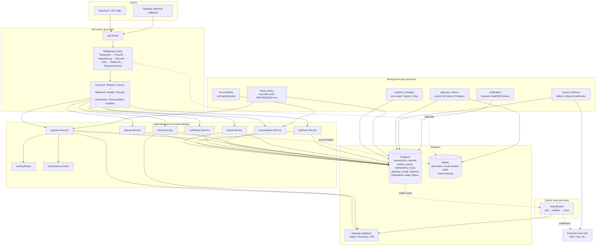

The design follows **hexagonal architecture**:

- `internal/domain/` — pure business rules with no I/O: the transaction state machine (`Txn`), refund invariants (over-refund protection), routing scoring, circuit breaker state machine, dispute state machine, notification types.
- `internal/app/` — use-case orchestration: takes domain objects and ports (interfaces), coordinates transactions, calls gateways, writes outbox events.
- `internal/ports/` — interfaces the app layer depends on (`GatewayAdapter`, `Logger`, `MetricRecorder`, `OutboxWriter`, `ConfigStore`, `DisputeStore`, `NotificationStore`, …), so the app layer never imports a concrete adapter.
- `internal/adapters/` — concrete implementations: Postgres repositories, Valkey rate limiter/circuit-breaker store, gateway HTTP clients, TLS manager, envelope encryption, slog-based logger, SNS publisher, SMTP email sender.
- `internal/api/` — HTTP-specific concerns: routing, middleware, request/response DTOs.

---

## 3. Project Layout

```
cmd/server/        Single binary entrypoint: API server, relay, and background jobs
config/            Environment-variable driven configuration + validation (viper)
seed/              Seed data for dev/testing (gateways, tenants, templates, sample txns)
internal/
  domain/
    transaction/   Txn entity + state machine
    refund/        Refund entity + over-refund guard
    gateway/       Circuit breaker state machine, discrepancy metrics, tenant config validation
    fees/          Fee calculation: nested breakdown (summary + fees + exchange + gateway)
    reconciliation/ Job + Entry entities, mismatch types, auto-resolution config
    dispute/       Dispute entity + state machine, evidence types
    notification/  Notification entity, templates, preferences
  app/
    payment/       Create, ProcessPayment, ProcessGatewayInitiate, GetGatewayMetadata, RecoverExpiredLease
    refund/        InitiateRefund, ProcessRefund, ResolveCancelRefund
    cancel/        Cancel intent handling
    webhook/       Inbound webhook → transaction resolution
    idempotency/   Reserve/Lookup/Complete guard used by payment & refund
    gateway/       Gateway listing with circuit breaker filtering
    dispute/       Dispute CRUD, evidence submission
    notification/  Dispatch + ProcessQueue: template rendering, channel routing
    reconciliation/ Reconciliation orchestration: compare transactions against gateway settlement reports
  adapters/
    postgres/      Repositories, migrations-backed queries, Transactor
    valkey/        Rate limiter (token bucket, Lua), circuit breaker store, intent store
    gateways/      stripe/, razorpay/, fib/ adapters + webhook parsers + settlement fetchers
    security/      mTLS certificate manager
    encryption/    Envelope encryption (KMS-style key manager)
    observability/ slog logger with field redaction, OTel metrics
    sns/           AWS SNS publisher
    notification/  SMTP email sender, stub SMS sender
    broadcast/     In-memory event bus for SSE
  api/
    handlers/      HTTP handlers (payment, refund, cancel, webhook, health, pay, gateway,
                   tenant_gateway, dispute, dead_letter, reconciliation, sse)
    middleware/    Auth, RateLimit, RequestID, TraceID, RequestLog, Recover, ResponseCache
    response/      Standard JSON envelope (success/error + request_id)
  jobs/
    partition_manager/  Weekly outbox partition lifecycle
    lease_expiry/       Stuck-transaction reaper + idempotency-key sweep
    gateway_metrics/    Circuit breaker + latency metrics persistence
    tenant_webhook/     Outbound webhook delivery with retry + HMAC signing
    notification/       Email/SMS queue processor
    reconciliation/     Background settlement reconciliation scheduler
  relay/           Generic outbox polling worker + publisher interface
  ports/           All interfaces + shared types (GatewayAdapter, Logger, ...)
  testsupport/     Shared Postgres/Valkey test harness
  bootstrap/       Startup helpers: retry policy, gateway registry wiring
test/integration/  End-to-end tests exercising real Postgres/Valkey
web/               Embedded static files + checkout templates
```

---

## 4. Core Domain: The Transaction Lifecycle

Every payment is represented by a `Txn` with a strictly enforced state machine (`internal/domain/transaction/state_machine.go`). Invalid transitions return `ErrInvalidTransition` rather than silently mutating state, and transitions out of `PROCESSING` clear the processing lease fields.

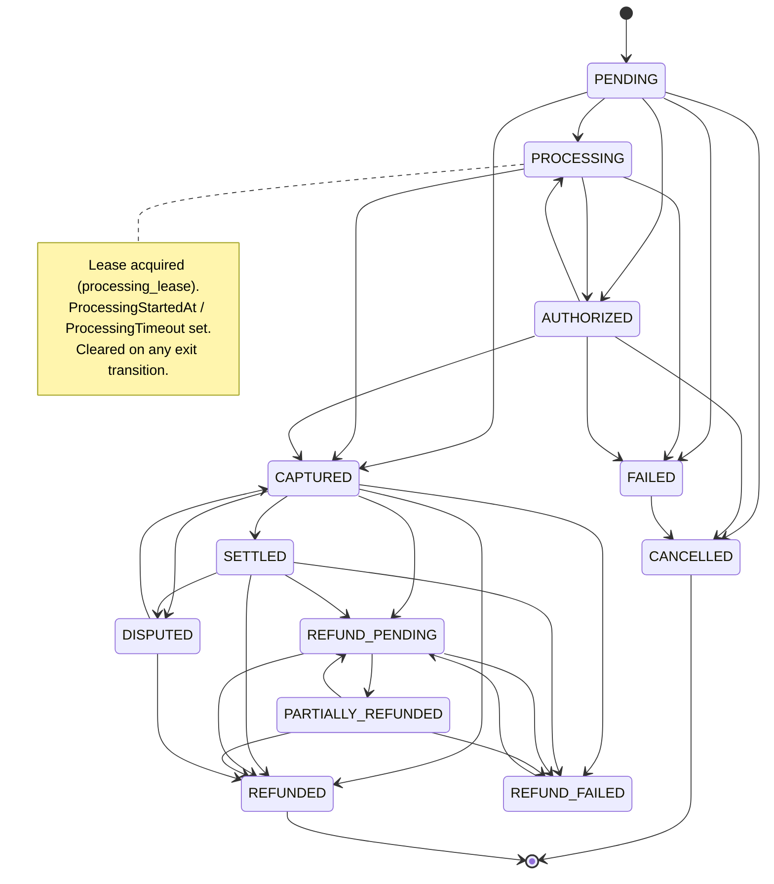

Notable rules baked into `transaction.go` / `state_machine.go`:

- `PENDING`, `PROCESSING`, `AUTHORIZED`, `CAPTURED`, `SETTLED`, `FAILED`, `CANCELLED`, `REFUND_PENDING`, `PARTIALLY_REFUNDED`, `REFUNDED`, `REFUND_FAILED`, `DISPUTED` are the 12 statuses (`AllStatuses()`).
- `IsTerminal()` is true for `SETTLED`, `CANCELLED`, `REFUNDED`, `REFUND_FAILED` — note that `SETTLED` is terminal for the *payment* even though a refund can still be attached afterward.
- `AUTHORIZED → PROCESSING` is valid: if a manual `capture` returns an ambiguous/timeout outcome, the transaction is left in `PROCESSING` (lease intact) so the lease-expiry reaper reconciles it via a read-only `CheckStatus` — it is never re-attempted blindly.
- `PROCESSING → CANCELLED` is valid (enables cancelling an in-flight payment).
- A transaction carries `Version` for **optimistic locking**: `UpdateStatus` fails with `ErrVersionConflict` if the stored version doesn't match, and `ErrNotFound` (a distinct case) if the row simply doesn't exist.
- `AttemptedGateway` vs `ActualGateway` are tracked separately so a fallback to a different gateway is visible (`HasGatewayDiscrepancy()`).

### Transaction fields

| Field | Purpose |
|---|---|
| `ID` | UUID primary key |
| `TenantID` | Scopes the transaction to a tenant |
| `UserID` | Optional — the user who initiated the payment |
| `Amount` | Payment amount in the user's currency (smallest unit, e.g. cents/fils) |
| `Currency` | ISO 4217 currency code (e.g. `USD`, `IQD`, `BDT`) |
| `PaymentMethod` | `card`, `upi`, `netbanking`, `wallet` |
| `Status` | Current state in the lifecycle |
| `Version` | Optimistic lock — incremented on every status change |
| `GatewayID` | Which gateway was used (e.g. `stripe`, `fib`) |
| `GatewayReferenceID` | Gateway's own payment reference |
| `AttemptedGateway` | First gateway attempted (before fallback) |
| `ActualGateway` | Gateway that actually processed the payment |
| `GatewayMetadata` | Gateway-specific output — stored in `transaction_gateway_metadata` table |
| `FeeBreakdown` | Nested JSON: summary + fees + exchange + gateway amounts |
| `GatewayAmount` | Amount the gateway charges (first-class column for aggregation) |
| `GatewayCurrency` | Currency the gateway charges in (first-class column) |
| `EstimatedTimeoutSeconds` | Processing lease TTL |
| `CancelIntent` | Whether a cancel was requested while PROCESSING |
| `TokenHash` | SHA-256 of the checkout token (browser auth) |
| `CallbackURL` | Where to redirect after payment |
| `RedirectURL` | Where to redirect after payment |
| `CreatedAt`, `UpdatedAt` | Timestamps |
| `ProcessingStartedAt`, `ProcessingTimeout` | Lease tracking fields |

---

## 5. Creating and Processing a Payment

The payment flow is a **single-step** synchronous call: `POST /api/v1/payments` creates the transaction and synchronously calls the gateway's `InitiatePayment`. The gateway-specific output (`gateway_metadata`) is persisted for the checkout page, which renders FIB's QR code, Stripe's card form, or Razorpay's checkout button — it is **not** returned in the create response.

### Step 1: Create + Initiate (single API call)

`POST /api/v1/payments` (service token, `Idempotency-Key` required) creates a transaction in `PENDING` state, calls the gateway's `InitiatePayment`, transitions to `PROCESSING`, and returns the transaction ID, checkout token, and status. A `GATEWAY_INITIATE` outbox event is also written as a fallback retry.

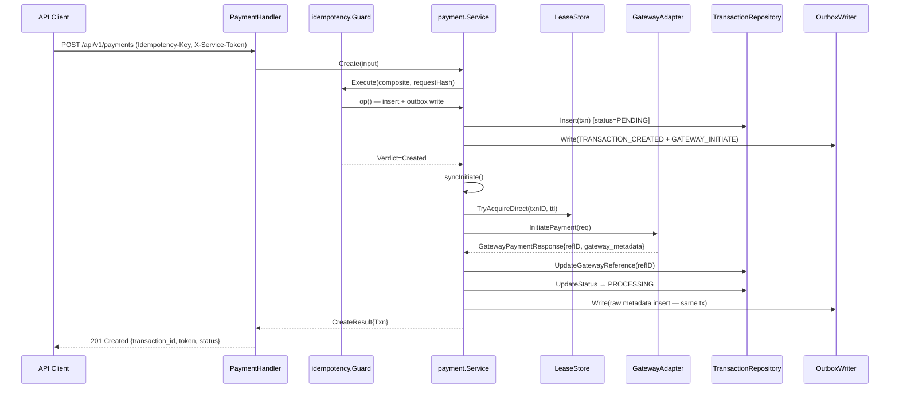

Key implementation details:

- **`Idempotency-Key` is mandatory** on `POST /api/v1/payments` and `POST /api/v1/payments/{id}/refunds`. It's combined with `tenantID + operation` into a composite hash (`idempotency.Composite`), and the request body is hashed (`idempotency.RequestHash`) to detect key reuse with a different payload (→ `409 idempotency_key_reused`).
- **The processing lease** (`processing_lease` table, `LeaseStore.TryAcquireDirect`) prevents two concurrent `ProcessGatewayInitiate` calls from both calling the gateway. If the lease isn't acquired, the event is skipped (the other instance will handle it).
- **`EstimatedTimeoutSeconds`** comes from `ConfigStore.GetProcessingTimeout(gateway, method)` and becomes the lease TTL — it must be positive or transaction creation fails.
- If `syncInitiate` errors (e.g. gateway adapter unavailable), the handler returns **`500`** with the transaction in `PENDING` state. The caller can retry with the same idempotency key (→ `200 Replayed`), and the outbox relay will eventually process the `GATEWAY_INITIATE` event as a fallback. The `GATEWAY_INITIATE` outbox event handler (`ProcessGatewayInitiate`) is idempotent — if the gateway reference already exists, it's a no-op.
- `gateway_metadata` contains gateway-specific output (e.g. `client_secret` for Stripe, `qr_code`/`readable_code`/`valid_until` for FIB, `order_id`/`key_id` for Razorpay). It is persisted in the `transaction_gateway_metadata` table and consumed by the checkout page (`GET /pay/{transaction_id}`) — it is **not** returned in the create or `GET /api/v1/payments/{id}` responses.
- `PublishableKey` is included in `gateway_metadata` for Stripe and Razorpay so the browser can initialize the gateway SDK without a separate config call.

### Step 2: Complete payment via checkout page

The browser opens the checkout page at `GET /pay/{transaction_id}?token={token}`. The page renders gateway-specific UI based on `gateway_metadata`:

- **FIB**: QR code with app links and countdown timer
- **Stripe**: Card form (Stripe Elements) mounted via Stripe.js — user enters card details, `confirmCardPayment` sends them directly to Stripe
- **Razorpay**: "Pay with Razorpay" button that opens the Razorpay checkout modal

The page subscribes to SSE at `GET /api/v1/payments/{id}/events?token={token}` for real-time status updates. If SSE fails, it falls back to polling `GET /api/v1/payments/{id}?token={token}` every 5 seconds. After 30 seconds without a terminal event, a timeout message is shown with a reload button.

### Step 2a: Outbox-initiated retry (fallback)

If the synchronous `syncInitiate` fails within `Create`, the `GATEWAY_INITIATE` outbox event written during insertion will be picked up by the outbox relay. The initiator handler calls `ProcessGatewayInitiate` which:

1. Acquires a processing lease (cross-instance dedup)
2. Calls the gateway's `InitiatePayment`
3. Updates `GatewayReferenceID` and transitions to `PROCESSING`
4. Inserts `gateway_metadata`

`ProcessGatewayInitiate` is idempotent: if `GatewayReferenceID != ""` or status is not `PENDING`, it returns nil (no-op). This ensures the sync path and the relay path don't conflict — whichever runs first succeeds.

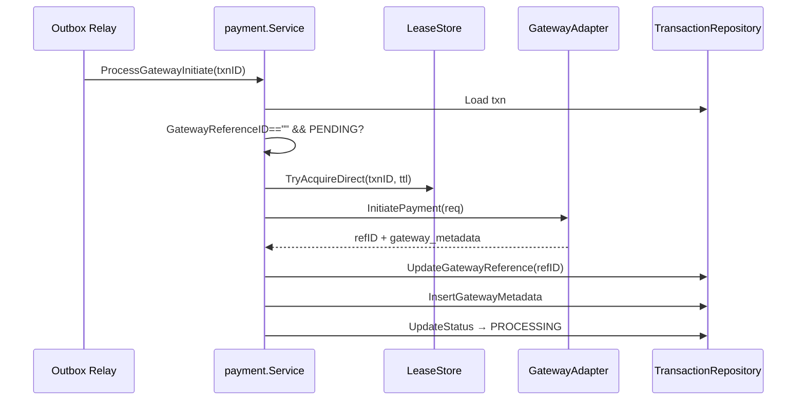

---

## 6. Gateway Selection & Capabilities

The payment path uses the **explicit `gateway_id`** from the caller's request. Each tenant configures which gateways they have credentials for via the tenant gateway config API (`/api/v1/tenants/{tenant_id}/gateways`). The caller discovers available gateways via `GET /api/v1/gateways` (returns all active gateways; per-tenant FX rates are resolved from the authenticated service token) and passes the chosen `gateway_id` in the payment request.

`GET /api/v1/gateways` returns:
```json
[
  {
    "gateway_id": "stripe",
    "display_name": "Stripe",
    "is_active": true,
    "supported_methods": ["card"],
    "supported_currencies": ["USD", "BDT"]
  }
]
```

Gateways whose circuit breaker is **OPEN** are excluded from this listing. If the Valkey breaker store is unreachable the gateway is included (fail-open — safe degradation).

### Gateway Capabilities Matrix

Each adapter declares its capabilities via `Capabilities()`:

| Gateway | Payment Methods | Currencies | Cancel | Partial Refund | Idempotent |
|---|---|---|---|---|---|
| **Stripe** | card | USD, EUR, GBP, BDT | No | Yes | Yes |
| **Razorpay** | card, UPI, netbanking, wallet | BDT | No | Yes | No |
| **FIB** | card | IQD | Yes | No | No |

### Tenant Gateway Configuration

Each tenant's gateway credentials are stored in `tenant_gateway_configs` with provider-specific JSON payloads:

**Stripe** (`StripeConfig`):
```json
{
  "api_key": "sk_test_...",
  "base_url": "https://api.stripe.com",
  "webhook_secret": "whsec_...",
  "publishable_key": "pk_test_..."
}
```

**Razorpay** (`RazorpayConfig`):
```json
{
  "key_id": "rzp_test_...",
  "key_secret": "...",
  "base_url": "https://api.razorpay.com",
  "publishable_key": "rzp_test_..."
}
```

**FIB** (`FIBConfig`):
```json
{
  "client_id": "fib-client-id-dev",
  "client_secret": "...",
  "base_url": "https://fib-stage.fib.iq",
  "callback_url": "http://localhost:8080/webhooks/gateway/fib"
}
```

All credentials are encrypted at rest when `ENCRYPTION_KEY` is configured (see §22). Without it, credentials are stored as plaintext (logged as warning on startup; rejected in production).

### Settlement Fetchers

Each gateway adapter may also implement `SettlementReportFetcher` for reconciliation:

| Gateway | Fetcher | API Used |
|---|---|---|
| **Stripe** | `FetchSettlementReport` | Balance Transaction API (`/v1/balance_transactions`) |
| **Razorpay** | `FetchSettlementReport` | Payment Listing API (`/v1/payments`) |
| **FIB** | Stub (returns empty report) | No dedicated settlement endpoint |

---

## 7. Gateway Error Handling

A single gateway call is made per payment attempt. The error category determines the outcome:

- **`HardDecline`** (e.g. `card_declined`, `expired_card`): the card/account was genuinely rejected. Terminal `FAILED` immediately. Counts as a circuit breaker success (the gateway is healthy).
- **`SoftDecline`** (e.g. `insufficient_funds`, `try_again_later`): plausibly transient. Terminal `FAILED` for the synchronous attempt; the caller may retry with a new idempotency key.
- **`NetworkTimeout` / `Ambiguous`**: the request may or may not have reached the gateway. The transaction is left **non-terminal** (`PROCESSING`) — the lease-expiry reaper (§17) later calls `CheckStatus` to resolve it definitively.
- **`GatewayError`** (5xx / unexpected): finalised as `FAILED` for the synchronous attempt, but counts as a circuit breaker failure.

Circuit breaker recording: `NetworkTimeout`, `GatewayError`, and `Ambiguous` count as failures; `HardDecline` and `SoftDecline` do not.

---

## 8. Circuit Breaker

`internal/domain/gateway` defines the state machine; `internal/adapters/valkey.CircuitBreakerStore` persists it atomically via Lua scripts (`RecordFailure`, `RecordSuccess`, `Transition`) so concurrent API instances agree on state without races.

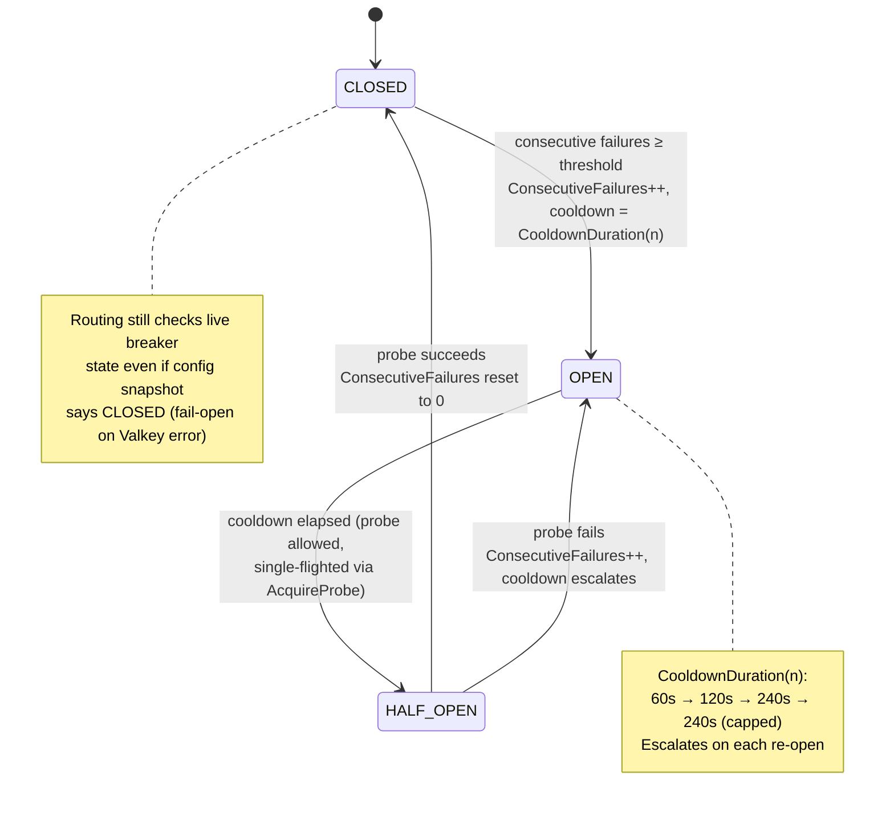

- **Cooldown escalation**: `CooldownDuration(n)` doubles per consecutive failure (60s, 120s, 240s), capped at 240s, so a gateway that keeps failing right after being re-enabled gets progressively longer timeouts instead of hammering it every 60 seconds.
- **Single-flighted probing**: `AcquireProbe` uses a Valkey `SETNX` so that when a breaker's cooldown has elapsed, only one in-flight request is allowed to "probe" the gateway (routed as if `HALF_OPEN`) while others still treat it as unavailable — avoiding a thundering herd hitting a gateway the moment its cooldown lapses.
- **Fail-open on Valkey outage**: if the breaker store itself is unreachable, `Router.liveBreakerState` falls back to the last-known state from the config snapshot rather than blocking all routing decisions on Valkey being up.
- Only `CLOSED → OPEN`, `OPEN → HALF_OPEN`, and `HALF_OPEN → {CLOSED, OPEN}` are legal; anything else (e.g. `CLOSED → HALF_OPEN` directly) is rejected by the transition script.
- **Gateway discovery respects circuit breaker state**: `GET /api/v1/gateways` filters out gateways whose Valkey circuit breaker state is non-routable (OPEN). This prevents callers from selecting an unhealthy gateway at checkout time. On Valkey error the gateway is included (fail-open).

### Discrepancy Metrics

The gateway domain also tracks discrepancy metrics (`DiscrepancyMetrics`):

| Alert Level | Condition | Meaning |
|---|---|---|
| `none` | Rate24H ≤ 0.02 | Normal operation |
| `investigate` | Rate24H > 0.02 | Elevated discrepancy rate — worth investigating |
| `alert` | Rate5Min > 0.05 | Recent spike — needs attention |
| `auto_disable` | Rate5Min > 0.20 | Critical — gateway should be auto-disabled |

The reliability score is computed as `(1 - Rate24H) * 100`, clamped to [0, 100]. A score of 0 means the gateway has >20% discrepancy rate in the last 24 hours.

---

## 9. Idempotency

Idempotency is enforced at **two layers**, both following the same Reserve → run-or-lookup → Complete shape:

1. **HTTP layer** (`middleware.Idempotency`): caches the *entire HTTP response* (status + body) keyed by `tenant + method + path + Idempotency-Key`, scoped per tenant so two different tenants can safely reuse the same key string.
2. **Business layer** (`app/idempotency.Guard`): used inside `payment.Service.Create` and `refund.Service.InitiateRefund` to guard the underlying domain operation itself (insert + outbox write), independent of how it's invoked.

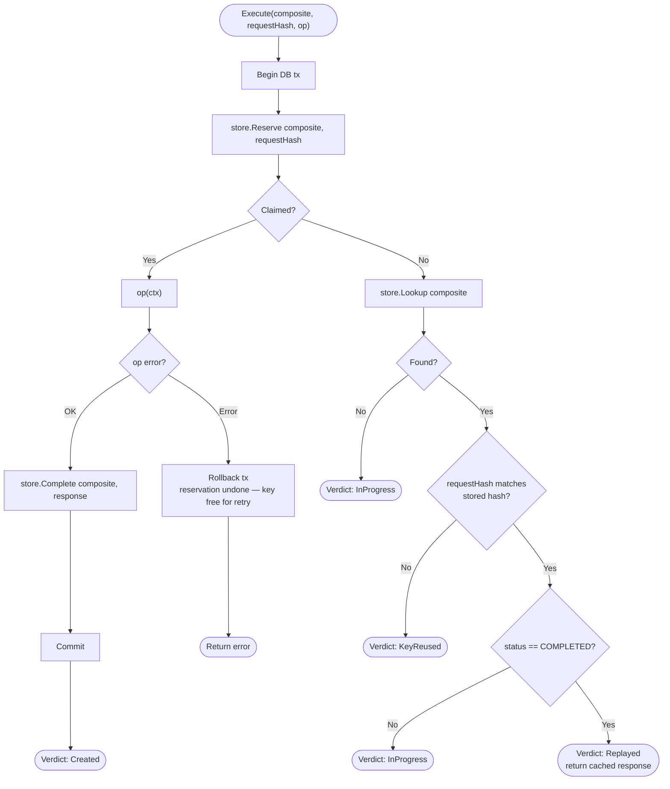

Four possible verdicts, mapped to distinct HTTP outcomes by the handlers:

| Verdict | Meaning | HTTP response |
|---|---|---|
| `Created` | First time seeing this key; op ran | `201 Created` |
| `Replayed` | Op already completed; cached response returned | `200 OK` |
| `InProgress` | Another request with this key is still running | `409 idempotency_in_progress` |
| `KeyReused` | Same key, different request body | `409 idempotency_key_reused` |

A failed op **rolls back the reservation** (the whole guard runs inside `Transactor.WithinTx`), so a request that errors midway doesn't permanently strand the key — a retry can claim it fresh. At the HTTP layer specifically, a `5xx` response is deliberately **not cached** and the reservation is released, for the same reason.

### Response Cache Middleware

The HTTP-layer idempotency also uses a `ResponseCacheStore` to cache successful responses. The cache key is `SHA-256(tenant + ":" + method + " " + path + ":" + idempotency_key)`. Only `2xx` responses are cached. On cache hit, the response includes an `Idempotent-Replayed: true` header. Non-mutating requests (GET, HEAD) bypass the cache entirely.

---

## 10. Transactional Outbox and Relay

Every state change that needs to notify the outside world writes an `outbox_events` row **inside the same database transaction** as the state change itself (`OutboxWriter.Write` requires an ambient tx via `WithTx`). This guarantees the event is never lost (it's part of the same atomic commit) and never emitted for a change that didn't actually persist (it's rolled back together).

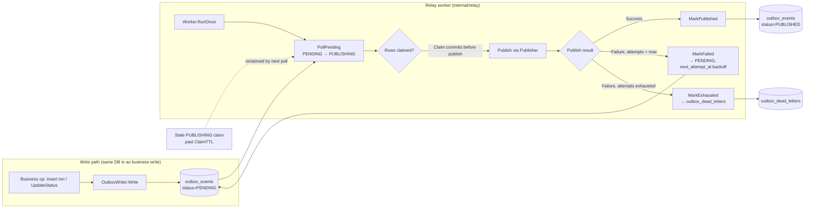

Design points that matter operationally:

- **Claim-before-publish, not select-then-publish**: `PollPending` atomically transitions matched rows `PENDING → PUBLISHING` (or reclaims stale `PUBLISHING` rows past `ClaimTTL`, default 60s) and *commits that claim* before the caller ever calls `Publish`.
- **Backoff on failure**: a failed publish sets `next_attempt_at` using exponential backoff (`Worker.backoff`, base × 2^attempts, capped at `MaxBackoff`) and returns the event to `PENDING` for retry, up to `MaxAttempts` (default 5).
- **Dead-lettering**: once attempts are exhausted, `MarkExhausted` moves the event to `outbox_dead_letters` in the same transaction it removes/marks the original — replayable later via `ReplayDeadLetter`, which re-enqueues a **new** event ID rather than resurrecting the old one.
- **Shard-aware polling**: `PollPending(shardMin, shardMax, ...)` lets multiple relay workers split the keyspace so they don't compete for the same rows, without needing external partitioning of workers.
- **Weekly partitioning**: `outbox_events` itself is a partitioned table (see §18) so old, fully-published partitions can be detached and dropped instead of bloating one ever-growing table.

### Event types

| Event | Emitted on | Aggregated by |
|---|---|---|
| `TRANSACTION_CREATED` | Payment created (`PENDING`) | transaction |
| `GATEWAY_INITIATE` | Payment created — fallback retry for `InitiatePayment` | transaction |
| `TRANSACTION_AUTHORIZED` | Manual `authorize` reached `AUTHORIZED` | transaction |
| `TRANSACTION_CAPTURED` | Payment confirmed (`CAPTURED`) | transaction |
| `TRANSACTION_SETTLED` | Manual `settle` reached `SETTLED` | transaction |
| `TRANSACTION_FAILED` | Payment failed (`FAILED`) | transaction |
| `TRANSACTION_CANCELLED` | Payment cancelled (`CANCELLED`) | transaction |
| `REFUND_INITIATED` | Refund requested (async refund flow) | refund |
| `REFUND_SUCCEEDED` | Refund completed / a `CANCELLED` cancel-resolution | refund |
| `REFUND_FAILED` | Refund terminal failure | refund |
| `TRANSACTION_CALLBACK` | Terminal transition — invokes the tenant `callback_url` | transaction |
| `DISPUTE_CREATED` / `DISPUTE_UPDATED` | Dispute opened / status changed | dispute |

Status → event mapping is centralized in `ports.EventTypeForTransactionStatus(status) (string, bool)`. Statuses with no distinct downstream event (`PENDING`, `PROCESSING`, `REFUND_PENDING`, `PARTIALLY_REFUNDED`, `REFUND_FAILED`, `DISPUTED`) return `ok=false`, and callers **skip publishing** rather than emit a bogus `TRANSACTION_FAILED`.

### Relay routing

The relay builds a `outbox.Router` whose routes run **in order**, side effects first, then a `*` catch-all that fans out to the configured publisher (SNS or log):

```go
outbox.Route{EventType: ports.EventTypeTransactionCallback, Handler: cbDispatcher},
outbox.Route{EventType: ports.EventTypeGatewayInitiate, Handler: initiatorHandler},
outbox.Route{EventType: ports.EventTypeRefundInitiated, Handler: refundInitHandler},
outbox.Route{EventType: "*", Handler: baseHandler},
```

Ordering matters: specific routes run before the wildcard, so an event that a side-effect handler consumes (e.g. `TRANSACTION_CALLBACK`) is **not** re-fanned-out to SNS on retry. The default publisher is `log` (events logged, not delivered); set `OUTBOX_PUBLISHER=sns` for real delivery (see §31 for local SNS via Floci).

---

## 11. Inbound Webhooks

`POST /webhooks/gateway/{gateway_id}` receives asynchronous status updates from gateways and reconciles them against the internal transaction record.

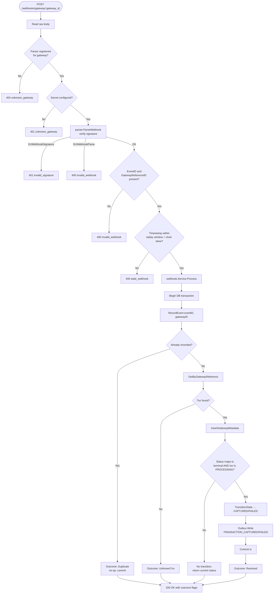

Security and correctness details:

- **Per-gateway signature verification** is delegated to each adapter's `ParseWebhook` (`GatewayWebhookParser`): Stripe verifies an HMAC-SHA256 over `timestamp.body` and rejects payloads outside a 300-second tolerance window; Razorpay verifies an HMAC-SHA256 header signature; FIB parses the raw JSON payload (`{id, paymentId, status}`) without signature verification (webhook secret is per-tenant from encrypted DB config).
- **Duplicate delivery is a no-op, not an error**: gateways commonly redeliver webhooks; `RecordEvent` uses a unique constraint on `(event_id, gateway_id)` so a redelivery is detected and short-circuited before any transaction mutation, still returning `200 OK`.
- **Only `PROCESSING` transactions are mutated**, and only for a status that maps to a terminal outcome (`succeeded/success/captured/paid` → `CAPTURED`; `failed/failure` → `FAILED`). A webhook arriving for an already-terminal or non-`PROCESSING` transaction is accepted but causes no transition — this prevents a stale or out-of-order webhook from clobbering a status that a different code path (e.g. the reaper) already resolved.
- **Timestamp/replay-window check** (`checkTimestamp`) is optional per gateway (`ConfigStore.WebhookPolicy`) and only enforced if the gateway sends an `X-Webhook-Timestamp` header.

---

## 12. Outbound Webhooks

When a transaction reaches a terminal state, the service can notify the tenant's own backend via outbound webhooks. This is separate from inbound webhooks (§11) — outbound webhooks are *from* the service *to* the tenant.

### How it works

1. **Event written to `tenant_webhook_deliveries` table** — when a transaction transitions to a terminal state, the webhook service inserts a delivery record with the event type, payload, and endpoint URL.
2. **Background worker picks it up** — the `tenant_webhook` job runs every 5 seconds, fetches up to 20 pending deliveries, and attempts HTTP POST to the tenant's configured endpoint.
3. **HMAC-SHA256 signing** — if the tenant's webhook config has a `SigningSecret`, the payload is signed and the signature is sent as `X-Webhook-Signature: sha256=<hex>`.
4. **Retry on failure** — failed deliveries (non-2xx response or network error) are retried with exponential backoff up to 10 attempts, with a 30-second initial backoff.

### Request headers sent to tenant

| Header | Value |
|---|---|
| `Content-Type` | `application/json` |
| `X-Webhook-Event` | Event type (e.g. `TRANSACTION_CAPTURED`) |
| `X-Delivery-ID` | UUID of the delivery record |
| `X-Webhook-Signature` | `sha256=<HMAC-SHA256 hex>` (if signing secret configured) |

### Tenant webhook configuration

Tenants configure their outbound webhook endpoint via the `tenant_webhook_configs` table:

| Field | Purpose |
|---|---|
| `tenant_id` | Which tenant this config belongs to |
| `endpoint_url` | URL to POST events to |
| `signing_secret` | HMAC-SHA256 key for signature verification |
| `is_active` | Whether outbound webhooks are enabled |

---

## 13. Refunds and Cancellation

### Refund invariants

`domain/refund.New` refuses to construct a refund that would push `alreadyRefunded + amount` past the original transaction amount, returning a typed `ErrOverRefund` — checked against a `SELECT ... FOR UPDATE`-style lock on the parent transaction (`LockParentTransaction`) so concurrent refund requests can't race past the cap.

Refund gateway outcomes follow the same "don't guess on ambiguity" principle as payments: a `GatewayError`/`NetworkTimeout`/`Ambiguous` response leaves the refund in `REFUND_PROCESSING` rather than declaring `REFUND_FAILED` (which would invite an unsafe retry that could double-refund).

### Cancel-intent race with a still-succeeding payment

The most interesting correctness case in the service: a tenant/ops cancel request can land *while a payment is still in flight at the gateway*. If the gateway ends up honoring the payment anyway, the service must notice and auto-refund exactly once.

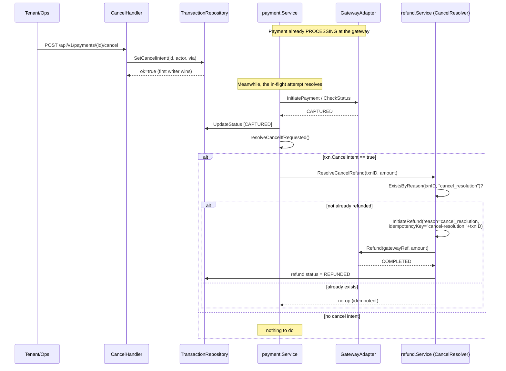

Why this is safe under concurrency:

- **`SetCancelIntent`** is a single conditional `UPDATE` — only the first caller for a given transaction wins, and it's a no-op on already-terminal transactions (`CancelService.Cancel` returns `ALREADY_TERMINAL` without writing).
- **`ResolveCancelRefund` is doubly idempotent**: it checks `ExistsByReason(txnID, "cancel_resolution")` before initiating anything, *and* the refund itself is initiated with a deterministic idempotency key (`"cancel-resolution:" + txnID`), so only one `cancel_resolution` refund is ever created.
- **`FAILED → CANCELLED` still requires `CancelIntent`** at the state-machine level (§4) — cancellation is never implicit, it's always driven by an explicit recorded intent.

---

## 14. Disputes

The service tracks payment disputes (chargebacks) initiated by gateways, with a state machine, evidence submission, and urgency tracking.

### Dispute state machine

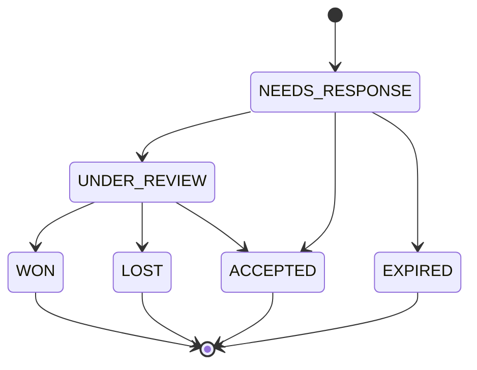

| Status | Meaning |
|---|---|
| `NEEDS_RESPONSE` | Dispute opened, evidence must be submitted by `EvidenceDueBy` |
| `UNDER_REVIEW` | Evidence submitted, gateway is reviewing |
| `WON` | Dispute resolved in merchant's favor |
| `LOST` | Dispute resolved against merchant |
| `ACCEPTED` | Merchant accepted the dispute |
| `EXPIRED` | Evidence deadline passed without submission |

### Evidence types

| Type | Meaning |
|---|---|
| `RECEIPT` | Proof of purchase |
| `INVOICE` | Invoice for the transaction |
| `CUSTOMER_COMMS` | Communication with the customer |
| `TERMS_OF_SERVICE` | Terms of service agreement |
| `REFUND_POLICY` | Refund policy |
| `CANCELLATION_POLICY` | Cancellation policy |
| `OTHER` | Other evidence |

### Urgency detection

`IsUrgent(warningDays)` returns true when the dispute is in `NEEDS_RESPONSE` or `UNDER_REVIEW` status AND the `EvidenceDueBy` is within `warningDays` days. The handler returns `is_urgent: true` and `days_until_due` in the response for UI to highlight.

---

## 15. Notifications

The service supports email and SMS notifications for payment lifecycle events, with per-tenant templates and user preferences.

### Notification types

| Type | Trigger |
|---|---|
| `PAYMENT_SUCCESS` | Transaction reaches `CAPTURED` |
| `PAYMENT_FAILURE` | Transaction reaches `FAILED` |
| `REFUND_COMPLETED` | Refund reaches `REFUNDED` |
| `REFUND_FAILED` | Refund reaches `REFUND_FAILED` |
| `DISPUTE_OPENED` | Dispute created |
| `DISPUTE_WON` | Dispute resolved as `WON` |
| `DISPUTE_LOST` | Dispute resolved as `LOST` |

### Channels

| Channel | Delivery |
|---|---|
| `EMAIL` | SMTP via `EmailSender` adapter |
| `SMS` | Via `SMSSender` adapter (stub in dev) |

### Templates

Templates are stored in `notification_templates` with Go template syntax:

```
Subject:  "Payment Successful"
BodyText: "Your payment of {{amount}} {{currency}} was successful. Reference: {{transaction_id}}"
BodyHTML: "<h1>Payment Successful</h1><p>Your payment of {{amount}} {{currency}} was successful.</p>"
SMSText:  "Payment of {{amount}}{{currency}} successful. Ref: {{transaction_id}}"
```

Template data is populated from the transaction/dispute context and rendered via `html/template`.

### User preferences

Users can enable/disable specific notification types on specific channels via `notification_preferences`. Preferences can also override the recipient address (`recipient_override`). If no preference exists, notifications are enabled by default.

### Dispatch flow

1. `Dispatch(ctx, notification)` is called by the app service when a terminal state is reached
2. User preferences are checked — if disabled for this type+channel, the notification is skipped
3. Template is loaded and rendered with the notification's `TemplateData`
4. Notification is inserted into the `notifications` table with status `PENDING`
5. The notification is sent immediately via the appropriate channel
6. Status is updated to `SENT` or `FAILED`

### Queue processor

The `notification` background job runs every 2 seconds, fetches up to 20 `PENDING` notifications, and attempts to send them. Failed sends are retried (status stays `FAILED` with `last_error` recorded).

---

## 16. Dead Letters

When outbox events exhaust their retry attempts or webhook deliveries fail permanently, they are moved to a dead-letter store for manual inspection and replay.

### Outbox dead letters

Events that fail after `MaxAttempts` (default 5) are moved from `outbox_events` to `outbox_dead_letters` with:
- Original event ID, aggregate ID, event type
- Error message from the last failed attempt
- Attempt count
- Creation timestamp

### Dead letter API

| Method | Path | Description |
|---|---|---|
| `GET` | `/api/v1/dead-letters` | List dead letters (filter by `?resolved=`, `?event_type=`, `?date_from=`, `?date_to=`, `?limit=`) |
| `POST` | `/api/v1/dead-letters/{id}/replay` | Re-enqueue a dead letter as a new event |

The replay endpoint creates a **new** event ID (not resurrecting the old one) and returns the new ID in the response. The caller provides an optional `reason` in the request body.

---

## 17. Lease-Expiry Reaper

A payment that got stuck `PROCESSING` — because the synchronous attempt hit a `NetworkTimeout`/`Ambiguous`/`GatewayError` and correctly declined to guess — needs something to eventually resolve it. That's the `lease_expiry` job, wired as a periodic goroutine inside the single process (runs immediately at startup, then on a configurable interval).

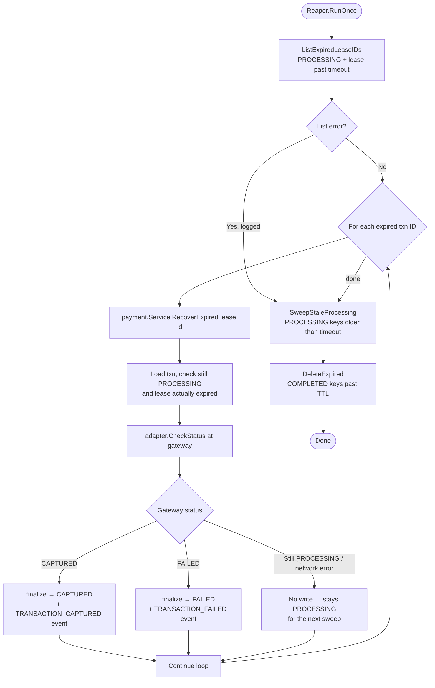

- **Status-check, never a blind retry**: `RecoverExpiredLease` calls `CheckStatus` (a read-only query against the gateway) rather than re-attempting `InitiatePayment`, so it can never create a duplicate charge — it only ever finds out what already happened and records that truth.
- **One failure doesn't abort the batch**: each transaction ID is recovered independently; a single recovery error is logged and the loop continues to the rest.
- **Piggy-backed idempotency-key hygiene**: the same run also sweeps `idempotency_keys` rows — `PROCESSING` rows older than `IdempotencyProcessingTimeout` (default 5 minutes) are cleared so retries aren't blocked forever, and `COMPLETED` rows past their TTL are purged to bound table growth.

---

## 18. Partition Management

`outbox_events` is partitioned **weekly** (`outbox_YYYY_Wnn`, ISO week numbering) to keep the hot table small and make old data cheap to age out. The `partition_manager` job (running as a periodic goroutine inside the single process) maintains this on a schedule.

Responsibilities, all guarded by a single Postgres advisory lock (`AcquireLock`/`ReleaseLock`) so only one instance does this work at a time even if the job is scheduled redundantly:

1. **Pre-create ahead**: creates partitions for the current ISO week plus `WeeksAhead` (default 2) weeks in advance, so writes never land in a fallback `outbox_default` partition due to a missing partition.
2. **Detach stale, empty partitions**: a partition older than `RetentionWeeks` (default 2) is detached **only if** `CountUnpublished` reports zero pending/failed rows in it — a partition that still has unpublished events is left alone regardless of age, so the relay always has something to poll.
3. **Drop after a grace period**: partitions detached more than `DropAfter` (default 14 days) ago are physically dropped, giving a window to notice a mistake before data is gone for good. Every detach/drop is also recorded via `LogAction` for an audit trail.

---

## 19. Rate Limiting

`internal/adapters/valkey.RateLimiter` implements a **token-bucket** algorithm executed atomically in Valkey via a Lua script (`scripts/token_bucket.lua`), keyed on three independent dimensions simultaneously — user, tenant, and IP — so exhausting one dimension's bucket doesn't consume tokens from the others.

- **Local in-memory fallback**: if Valkey is unavailable for `failureThreshold` (3) consecutive calls, the limiter flips to a local, per-process token bucket sized at `capacity × FallbackMultiplier` (default 0.5 — deliberately more conservative than the Valkey-backed limit), backed by an LRU (`container/list`) capped at `LocalMaxBuckets` to bound memory. A background health check restores the Valkey-backed path once it recovers.
- **Merchant bucket key comes from the authenticated principal**, never a client-supplied header — `tenantBucketID` reads from request context (set by the auth middleware), so a spoofed `X-Tenant-ID` header can't be used to attribute load to (or rate-limit) a different tenant.
- Rejections return `429` with a computed `Retry-After` header (minimum 1 second).

---

## 20. Authentication and Authorization

The service uses two independent auth layers depending on caller type.

### API callers (service tokens)

Configured via environment variables:

- **Service tokens** (`X-Service-Token`) map to a specific `TenantID` and `UserID` — the tenant identity is *bound to the token*, not read from any request header, which is what makes the rate-limiter tenant-key spoofing protection in §19 possible.
- **Ops tokens** (`X-Ops-Token`) grant the `ops` role without a tenant binding (used for cancel/refund operational actions).

Tokens are stored hashed (SHA-256) in memory.

### Browser callers (checkout token)

Browser-facing paths are exempt from service-token auth. Instead, a per-transaction **checkout token** is generated at payment creation time (`POST /api/v1/payments`) and returned in the `token` response field. The browser presents this token on every subsequent call via the `pay/` paths:

| Path | Token location |
|---|---|
| `GET /pay/{transaction_id}` | `?token=` query param |
| `GET /api/v1/payments/{id}` | `?token=` query param |
| `GET /api/v1/payments/{id}/events` | `?token=` query param |

The token is a 32-byte cryptographically random value (SHA-256 hashed on the transaction row). It is valid for the lifetime of the `PENDING` transaction and requires no service token.

### Tenant isolation

Service tokens can only query their own tenant's data. On `GET /api/v1/payments`, if a service token provides a `tenant_id` query param that doesn't match its own tenant, the request is rejected with `403 tenant_mismatch`. Ops tokens can query any tenant.

### Exempt path summary

| Path | Auth |
|---|---|
| `GET /health` | None |
| `POST /webhooks/*` | Gateway signature |
| `GET /pay/*` | Checkout token |
| `POST /api/v1/payments` (service token) | **Service token required** |
| `GET /api/v1/payments/{id}` | Service token **or** checkout token |
| `GET /api/v1/payments/{id}/events` | Service token **or** checkout token |
| All other `/api/v1/*` | Service / ops token required |

---

## 21. Transport Security (mTLS)

`internal/adapters/security.Manager` wraps Go's `crypto/tls` to support mutual TLS with **hot certificate rotation**:

- Loads the server keypair and (optionally) a client-CA pool; if `MtlsStrictMode` is enabled, unauthenticated/untrusted client certificates are rejected (`RequireAndVerifyClientCert`), otherwise client certs are verified only if presented (`VerifyClientCertIfGiven`).
- `StartRefresh(ctx)` runs a background ticker (`CertRefreshIntervalSec`) that reloads the certificate and CA pool from disk without restarting the process — new connections pick up the rotated cert immediately via `GetConfigForClient`, existing connections are unaffected.
- If `TLS_CERT_FILE` isn't configured, the server runs plain HTTP (suitable for local dev or when TLS is terminated upstream, e.g. behind a load balancer).

---

## 22. Field-Level Encryption

`internal/adapters/encryption` implements **envelope encryption** for sensitive fields (gateway credentials in `tenant_gateway_configs`):

- A `KeyManager` (local AES-GCM implementation provided; swappable for a real KMS) generates and unwraps per-use **data encryption keys (DEKs)**, each wrapped under a master key with the key ID bound as authenticated-associated-data (AAD) — so a DEK wrapped under one key ID can never be unwrapped under a different one, even with the same master key.
- `Envelope` caches a current DEK and reuses it across encryptions up to `MaxDEKUses` (default ~1M) or `DEKTTL` (default 1h), whichever comes first, avoiding a KMS round-trip per encryption while still rotating regularly.
- A separate **decrypt-side cache** (`dekCache`, keyed by a hash of the wrapped DEK, TTL default 1h) avoids re-unwrapping the same DEK repeatedly when decrypting many records that share it.
- All ciphertext is authenticated (AES-GCM) and bound to caller-supplied AAD (e.g. `"transaction:card:tx-1"`), so ciphertext can't be replayed into a different field/record context even by an attacker who can write to the database.

When `ENCRYPTION_KEY` is not configured, the service logs a warning and stores credentials as plaintext. In production (`environment=prod`), the service refuses to start without `ENCRYPTION_KEY`.

---

## 23. Middleware

The middleware chain is applied in order (outermost → innermost):

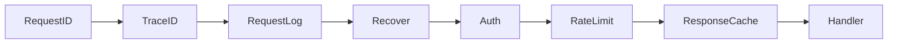

### RequestID

- Reads `X-Request-ID` from the incoming request; generates a UUID if absent.
- Sets `X-Request-ID` on the response.
- Stores the ID in context for downstream handlers.

### TraceID

- Reads `X-Trace-ID` from the incoming request; falls back to parsing the W3C `traceparent` header (`00-<trace_id>-<span_id>-<flags>`); generates a UUID if neither is present.
- Stores the trace ID in context for distributed tracing correlation.

### RequestLog

- Wraps the `http.ResponseWriter` to capture the status code.
- Creates a per-request logger with `request_id` and `trace_id` fields injected into context.
- Logs `http.request` with method, path, sanitized query, status, and duration (ms).
- **Query sanitization**: sensitive query params (e.g. `token`) are replaced with `<redacted>` before logging.

### Recover

- Catches panics, logs `http.panic_recovered` with the trace ID and path, and returns `500 internal_error`.
- Uses the per-request logger from context if available, otherwise falls back to the global logger.

### Authenticate

- Checks for `X-Service-Token` or `X-Ops-Token` headers.
- Looks up the token in the in-memory hash map.
- For service tokens, extracts `tenant_id` and `user_id` and stores them in context (`PrincipalFromContext`).
- For ops tokens, sets the role to `ops` without a tenant binding.
- Exempts paths that don't require auth: `GET /health`, `POST /webhooks/*`, `GET /pay/*`.

### RateLimit

- Reads the tenant ID from the authenticated principal (not from request headers).
- Calls the token-bucket rate limiter with user, tenant, and IP dimensions.
- Returns `429` with `Retry-After` header on rejection.

### ResponseCache

- Intercepts mutating requests (POST, PUT, PATCH, DELETE) that include an `Idempotency-Key` header.
- On cache hit, replays the cached response with `Idempotent-Replayed: true` header.
- On cache miss, records the response and caches `2xx` results.
- Cache key: `SHA-256(tenant + ":" + method + " " + path + ":" + idempotency_key)`.

---

## 24. SSE Events

`GET /api/v1/payments/{id}/events` provides a Server-Sent Events stream for real-time transaction status updates.

### Connection flow

1. Client connects with either a service token (tenant-scoped) or checkout token (`?token=` query param).
2. Server validates the token and checks tenant ownership.
3. Server subscribes to the in-memory `EventBus` for the transaction ID.
4. Server sends an initial `event: connected\ndata: {}\n\n` frame.
5. Server enters a loop: sends `event: status\ndata: {"status":"..."}\n\n` frames when the transaction status changes, and `: heartbeat\n\n` comments every 30 seconds to keep the connection alive.
6. On client disconnect (context cancelled), the server unsubscribes from the bus.

### Event format

```
event: connected
data: {}

event: status
data: {"status":"CAPTURED"}

: heartbeat

event: status
data: {"status":"REFUNDED"}
```

### In-memory EventBus

The `broadcast.InMemoryBus` is a simple pub/sub system backed by Go channels. Each transaction ID maps to a set of subscriber channels. When a transaction status changes, the payment service or webhook service publishes a `StatusEvent` to the bus, which fans out to all active subscribers.

---

## 25. Observability

- **Structured logging** (`internal/adapters/observability.SlogLogger`) wraps `log/slog` with a custom `TRACE` level below `DEBUG`, and **automatically redacts** known-sensitive field keys (`vpa`, `card_number`, `pan`, `cvv`, `card_cvv`, `token`, `api_key`, `client_secret`, `secret`, `password`, `authorization`, `access_token`, `refresh_token`, `private_key` — case-insensitive) to `<redacted>` before they're ever written to output.
- **Error-log contract enforcement**: `Logger.Error` checks for required fields (`error_code`, `trace_id`, `transaction_id`) on every call and appends a `log_validation_error` note if any are missing — a lightweight guardrail against error logs that are hard to correlate later, without failing the call itself.
- **Metrics**: a `MetricRecorder` port is defined with counters/histograms/gauges for transaction outcomes, gateway fallback/circuit-breaker events, outbox publish latency/failures, and rate-limiter fallback activity (see `internal/ports/metrics.go` for the full catalog). Backends are selected via `OBSERVABILITY_BACKEND`: `otel`/`otlp` (a real OTLP exporter — grpc or `http/protobuf`), `stdout`/`noop` (discard). `config.yaml` defaults to `otel` pointing at the local `otel-collector` relay → OpenObserve (§31); in an empty environment it degrades to no-op without failing.
- **Logs**: with `OBSERVABILITY_BACKEND=otel|otlp` the slog logger is a dual handler that writes JSON to stdout *and* bridges each record to the OTLP log provider via `otelslog` — so every log lands in OpenObserve's Logs tab while stdout keeps working unchanged. With `stdout`/`noop` it stays stdout-only.
- **Traces**: with `otlp` a `TracerProvider` is registered globally. An OTel middleware in the request chain starts a span per request (joined to any incoming W3C `traceparent`), exposing `X-Trace-ID`/`X-Span-ID` response headers; background jobs open a `job.<name>` span each run. Trace/log exporters are wired via the same collector relay.

---

## 26. Fee System

The payment service calculates fees before calling the gateway, so the user sees the total cost at checkout with no surprise on their bank statement.

### Fee Breakdown Structure

The `fee_breakdown` field in payment responses has a nested 2-part structure:

```json
{
  "summary": { "amount": 50000, "fees": 1750, "total": 51750, "currency": "IQD" },
  "fees": {
    "service_fee": 1250,
    "fixed_charge": 500,
    "total": 1750,
    "exchange": { "base_rate": 1500, "markup_pct": 3, "effective": 1545 }
  },
  "gateway": { "amount": 51750, "currency": "IQD" }
}
```

- **`summary`**: what the user pays — base amount, fees, total, all in user's currency
- **`fees`**: how fees are composed — service fee (reverse-inclusive percentage), fixed charge, optional exchange info (only present when currency conversion applies)
- **`gateway`**: what the gateway receives — final amount in gateway's currency

### Two-Layer Fee Calculation

1. **Layer 1 — Exchange rate with markup**: converts user amount to gateway charges currency using `effectiveRate = baseRate + (baseRate/100 * markupPct) + markupFixed`
2. **Layer 2 — Reverse-inclusive service fee + fixed charge**: `serviceFee = amount / (1 - ratio/100) - amount`, then adds fixed charge. All in gateway currency, converted back to user currency for display.

### Gateway Amount

`gateway_amount` and `gateway_currency` are first-class columns on the `transactions` table (not just inside `fee_breakdown` JSONB) for efficient aggregation and reconciliation queries.

### Fee Estimation

`GET /api/v1/gateways` returns per-gateway fee model information (`GatewayFeeModel`) including `fixed_fee`, `percentage_bps`, `charges_currency`, and optional `interchange_cap`. Callers can estimate fees client-side before creating a payment.

---

## 27. Reconciliation

Reconciliation compares internal transaction records against gateway settlement reports to detect discrepancies.

### Architecture

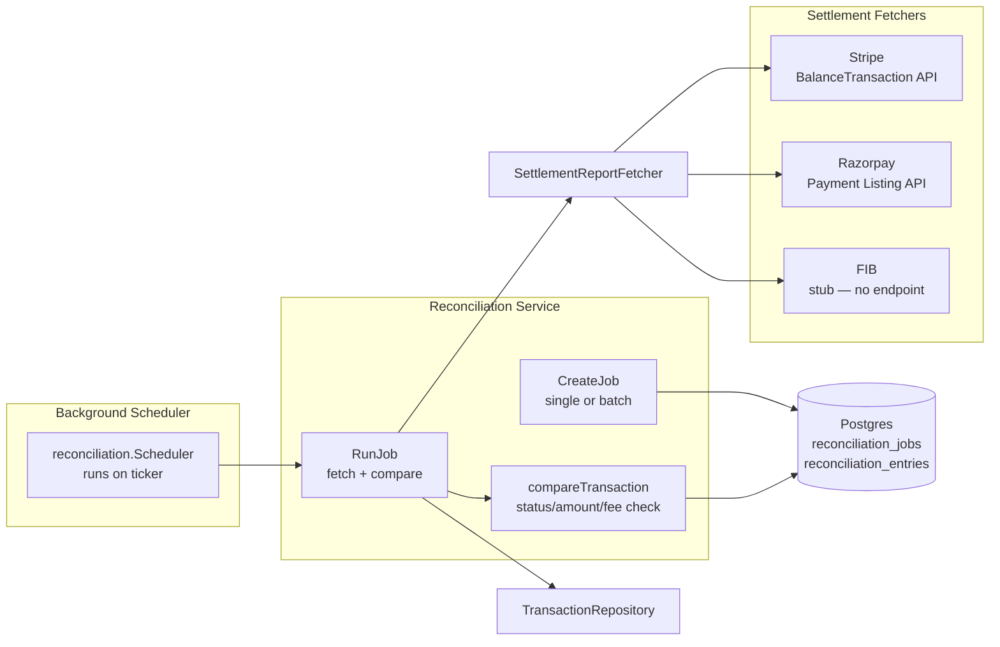

### Mismatch Types

| Type | Meaning | Critical? |
|------|---------|-----------|
| `STATUS_MISMATCH` | Internal status differs from gateway status | Yes |
| `AMOUNT_MISMATCH` | Internal amount differs from gateway amount | No |
| `FEE_MISMATCH` | Internal fees differ from gateway fees | No |
| `MISSING_INTERNAL` | Gateway has entry, internal doesn't | Yes |
| `MISSING_GATEWAY` | Internal has entry, gateway doesn't | No |

### Auto-Resolution

Amount mismatches within configurable thresholds (basis points + absolute cap) are eligible for automatic resolution. Status mismatches and missing-internal entries always require manual review.

### Single vs Batch

- **Single-transaction**: compares one transaction against `CheckStatus` at the gateway.
- **Batch by period**: fetches all internal transactions for a gateway+period, fetches the settlement report from the gateway, and compares each pair. Missing entries are flagged as `MISSING_INTERNAL` or `MISSING_GATEWAY`.

---

## 28. API Reference

| Method | Path | Auth | Description |
|---|---|---|---|
| `GET` | `/health` | none | DB + Valkey connectivity check |
| `GET` | `/pay/{transaction_id}` | checkout token (`?token=`) | Checkout page |
| `GET` | `/pay/success` | checkout token (`?token=`) | Payment success landing page |
| `GET` | `/pay/failure` | checkout token (`?token=`) | Payment failure landing page |
| `GET` | `/api/v1/gateways` | service/ops token | List all active gateways (per-method `fee_breakdowns` when `?currency=` + `?amount=` provided) |
| `POST` | `/api/v1/payments` | service token | Create transaction + initiate gateway payment. Requires `Idempotency-Key`. |
| `GET` | `/api/v1/payments` | service/ops token | List transactions with filters (see below) |
| `GET` | `/api/v1/payments/{id}` | service/ops or checkout token | Fetch a transaction by ID |
| `POST` | `/api/v1/payments/{id}/authorize` | service/ops token | Transition to AUTHORIZED (requires manual capture mode) |
| `POST` | `/api/v1/payments/{id}/capture` | service/ops token | Transition to CAPTURED |
| `POST` | `/api/v1/payments/{id}/settle` | service/ops token | Transition to SETTLED |
| `POST` | `/api/v1/payments/{id}/refunds` | service/ops token | Initiate + immediately attempt a refund. Requires `Idempotency-Key`. |
| `POST` | `/api/v1/payments/{id}/cancel` | service/ops token | Request cancellation (idempotent) |
| `GET` | `/api/v1/payments/{id}/events` | service/ops or checkout token | SSE stream of transaction status changes |
| `GET` | `/api/v1/tenants/{tenant_id}/gateways` | service/ops token | List a tenant's gateway configurations |
| `GET` | `/api/v1/tenants/{tenant_id}/gateways/{gateway_id}` | service/ops token | Get a single tenant gateway config |
| `POST` | `/api/v1/tenants/{tenant_id}/gateways` | service/ops token | Create or update a tenant gateway config |
| `DELETE` | `/api/v1/tenants/{tenant_id}/gateways/{gateway_id}` | service/ops token | Delete a tenant gateway config |
| `POST` | `/webhooks/gateway/{gateway_id}` | gateway signature | Inbound gateway status callback |
| `GET` | `/api/v1/disputes` | service/ops token | List disputes (filter by `?status=`, `?gateway_id=`, `?date_from=`, `?date_to=`) |
| `GET` | `/api/v1/disputes/{id}` | service/ops token | Get a single dispute |
| `POST` | `/api/v1/disputes/{id}/evidence` | service/ops token | Submit evidence for a dispute |
| `GET` | `/api/v1/disputes/{id}/evidence` | service/ops token | List evidence for a dispute |
| `GET` | `/api/v1/dead-letters` | service/ops token | List dead letters (filter by `?resolved=`, `?event_type=`, `?date_from=`, `?date_to=`, `?limit=`) |
| `POST` | `/api/v1/dead-letters/{id}/replay` | service/ops token | Re-enqueue a dead letter as a new event |
| `POST` | `/api/v1/reconciliation/jobs` | service/ops token | Create a reconciliation job |
| `GET` | `/api/v1/reconciliation/jobs` | service/ops token | List reconciliation jobs (filter by `?gateway_id=`, `?status=`) |
| `GET` | `/api/v1/reconciliation/jobs/{id}` | service/ops token | Get a single reconciliation job |
| `POST` | `/api/v1/reconciliation/jobs/{id}/run` | service/ops token | Execute a pending reconciliation job |
| `GET` | `/api/v1/reconciliation/jobs/{id}/entries` | service/ops token | List reconciliation entries (filter by `?mismatch_type=`, `?resolution_status=`) |
| `POST` | `/api/v1/reconciliation/jobs/{id}/entries/{entry_id}/resolve` | service/ops token | Mark a reconciliation entry as resolved |

**Manual capture flow** (`authorize` → `capture` → `settle`, ops tokens): each call acquires the processing lease (`TryAcquireDirect`) before invoking the gateway, so concurrent calls cannot double-fire; a lease loser reloads the current transaction and returns it. Terminal outcomes route through the same `finalize` machinery as the initiate flow — they emit `TRANSACTION_AUTHORIZED` / `TRANSACTION_CAPTURED` / `TRANSACTION_SETTLED` outbox events plus callback, notification, tenant webhook, audit, and SSE. An ambiguous or timeout outcome keeps the transaction in `PROCESSING` (with lease timestamps) so the lease-expiry reaper reconciles it via a read-only `CheckStatus`. `authorize` requires the gateway to be in manual-capture mode (otherwise `capture_mode` is auto and the transition is rejected).

### Transaction List Filters

`GET /api/v1/payments` supports the following query parameters:

| Parameter | Type | Description |
|---|---|---|
| `tenant_id` | UUID | Filter by tenant (service tokens are auto-scoped to their own tenant) |
| `user_id` | UUID | Filter by user |
| `status` | CSV | Filter by status (e.g. `?status=CAPTURED,FAILED`) |
| `gateway_id` | CSV | Filter by gateway (e.g. `?gateway_id=stripe,fib`) |
| `min_amount` | int | Minimum amount |
| `max_amount` | int | Maximum amount |
| `currency` | string | Filter by currency |
| `payment_method` | CSV | Filter by payment method |
| `date_from` | RFC3339 | Start date filter |
| `date_to` | RFC3339 | End date filter |
| `cursor` | string | Cursor for pagination |
| `limit` | int | Page size (1-100, default 50) |

**CSV export**: Set `Accept: text/csv` to receive the list as a CSV download.

### Request/Response Examples

**Create Payment:**
```http
POST /api/v1/payments
X-Service-Token: test-token
Idempotency-Key: payment-unique-key
Content-Type: application/json

{
  "gateway_id": "stripe",
  "amount": 50000,
  "currency": "BDT",
  "payment_method": "card",
  "capture_mode": "auto",
  "customer_id": "33333333-3333-3333-3333-333333333333",
  "customer_email": "buyer@example.com",
  "description": "Order #1234",
  "metadata": { "order_id": "ORD-1234" },
  "callback_url": "https://example.com/callback",
  "redirect_url": "https://example.com/redirect"
}
```

**Response (Stripe):**
```json
{
  "success": true,
  "data": {
    "transaction_id": "txn-uuid",
    "status": "PROCESSING",
    "token": "checkout-token",
    "fee_breakdown": {
      "summary": { "amount": 50000, "fees": 1750, "total": 51750, "currency": "BDT" },
      "fees": { "service_fee": 1250, "fixed_charge": 500, "total": 1750 },
      "gateway": { "amount": 51750, "currency": "BDT" }
    },
    "gateway_amount": 51750,
    "gateway_currency": "BDT"
  },
  "request_id": "req-uuid",
  "timestamp": "2026-01-01T00:00:00.000000000Z"
}
```

**Response (FIB):**
```json
{
  "success": true,
  "data": {
    "transaction_id": "txn-uuid",
    "status": "PROCESSING",
    "token": "checkout-token",
    "fee_breakdown": {
      "summary": { "amount": 50000, "fees": 1750, "total": 51750, "currency": "IQD" },
      "fees": { "service_fee": 1250, "fixed_charge": 500, "total": 1750 },
      "gateway": { "amount": 51750, "currency": "IQD" }
    },
    "gateway_amount": 51750,
    "gateway_currency": "IQD"
  },
  "request_id": "req-uuid",
  "timestamp": "2026-01-01T00:00:00.000000000Z"
}
```

---

## 29. API Response Format

All API responses use a standard JSON envelope:

**Success:**
```json
{
  "success": true,
  "data": { ... },
  "request_id": "req-uuid"
}
```

**Error:**
```json
{
  "success": false,
  "error": {
    "code": "error_code",
    "message": "Human-readable message"
  },
  "request_id": "req-uuid"
}
```

### Error codes

| Status | Code | Meaning |
|---|---|---|
| 400 | `invalid_request_body` | Request body is not valid JSON |
| 400 | `missing_gateway_id` | `gateway_id` is required |
| 400 | `invalid_amount` | Amount must be positive |
| 400 | `missing_fields` | Required fields missing |
| 400 | `missing_callback_url` | `callback_url` is required |
| 400 | `missing_redirect_url` | `redirect_url` is required |
| 400 | `missing_idempotency_key` | `Idempotency-Key` header is required |
| 400 | `invalid_id` | ID must be a valid UUID |
| 400 | `invalid_tenant_id` | `tenant_id` must be a valid UUID |
| 401 | `unauthorized` | Missing or invalid authentication |
| 403 | `forbidden` | Cannot access other tenant's resources |
| 403 | `tenant_mismatch` | Service token cannot query other tenants |
| 404 | `not_found` | Resource not found |
| 409 | `idempotency_in_progress` | Request with this key is still running |
| 409 | `idempotency_key_reused` | Same key, different request body |
| 422 | `no_eligible_gateway` | No gateway can process this payment |
| 422 | `not_refundable` | Transaction cannot be refunded |
| 422 | `over_refund` | Refund would exceed original amount |
| 422 | `initiate_failed` | Gateway initiate failed |
| 429 | (rate limited) | Includes `Retry-After` header |
| 500 | `internal_error` | Internal server error |
| 500 | `create_failed` | Could not create payment (retry with same idempotency key) |

---

## 30. Configuration

All configuration comes from `config.yaml` with environment variable overrides, loaded and validated in `config/config.go` (`LoadConfig` fails fast with an aggregated list of every missing/invalid value). A `.env` file in the working directory is auto-loaded if present (`godotenv.Load`).

### Full environment variable reference

| Area | Env Var | Config Key | Default | Notes |
|---|---|---|---|---|
| App | `SERVICE_NAME` | `app.service_name` | `payment-service` | |
| App | `ENVIRONMENT` | `app.environment` | — | `prod`, `staging`, or `dev` (required) |
| App | `SERVICE_VERSION` | `app.service_version` | — | |
| App | `PORT` | `app.port` | — | HTTP listen port |
| App | `MTLS_STRICT_MODE` | `app.mtls_strict_mode` | `false` | |
| Startup | `STARTUP_CONNECT_MAX_ATTEMPTS` | `startup.connect_max_attempts` | — | Retries for DB/Valkey connection |
| Startup | `STARTUP_CONNECT_ATTEMPT_TIMEOUT` | `startup.connect_attempt_timeout_sec` | — | Per-attempt timeout |
| Startup | `STARTUP_CONNECT_BACKOFF` | `startup.connect_backoff_sec` | — | Backoff between attempts |
| Database | `DATABASE_PRIMARY_HOST` | `database.primary_host` | — | Required |
| Database | `DATABASE_REPLICA_HOST` | `database.replica_host` | — | Optional read replica |
| Database | `DATABASE_PORT` | `database.port` | `5432` | |
| Database | `DATABASE_NAME` | `database.name` | — | Required |
| Database | `DATABASE_USER` | `database.user` | — | Required |
| Database | `DATABASE_PASSWORD` | `database.password` | — | Required |
| Database | `DATABASE_SSL_MODE` | `database.ssl_mode` | `disable` | |
| Database | `DATABASE_MAX_OPEN_CONNS` | `database.max_open_conns` | — | Connection pool |
| Database | `DATABASE_MAX_IDLE_CONNS` | `database.max_idle_conns` | — | Connection pool |
| Database | `DATABASE_CONN_MAX_LIFETIME` | `database.conn_max_lifetime_sec` | — | |
| Database | `DATABASE_CONN_MAX_IDLE_TIME` | `database.conn_max_idle_time_sec` | — | |
| Database | `DATABASE_HEALTH_CHECK_PERIOD` | `database.health_check_period_sec` | — | |
| Valkey | `VALKEY_ADDRS` | `valkey.addrs` | — | Comma-separated |
| Valkey | `VALKEY_RATE_LIMIT_DB` | `valkey.rate_limit_db` | `0` | |
| Valkey | `VALKEY_CACHE_DB` | `valkey.cache_db` | `1` | |
| Valkey | `VALKEY_DIAL_TIMEOUT` | `valkey.dial_timeout_sec` | — | |
| Valkey | `VALKEY_READ_TIMEOUT` | `valkey.read_timeout_sec` | — | |
| Valkey | `VALKEY_WRITE_TIMEOUT` | `valkey.write_timeout_sec` | — | |
| Outbox | `OUTBOX_RELAY_BATCH_SIZE` | `outbox.batch_size` | — | |
| Outbox | `OUTBOX_RELAY_MAX_ATTEMPTS` | `outbox.max_attempts` | `5` | |
| Outbox | `OUTBOX_RELAY_POLL_INTERVAL_SEC` | `outbox.poll_interval_sec` | — | |
| Outbox | `OUTBOX_RELAY_CLAIM_TTL_SEC` | `outbox.claim_ttl_sec` | `60` | |
| Outbox | `OUTBOX_RELAY_WAL_LAG_ALERT_THRESHOLD_MB` | `outbox.wal_lag_alert_threshold_mb` | — | |
| Outbox | `OUTBOX_RELAY_WAL_LAG_CRITICAL_THRESHOLD_MB` | `outbox.wal_lag_critical_threshold_mb` | — | |
| Outbox | `OUTBOX_PUBLISHER` | `outbox.publisher` | — | `sns` or empty |
| Outbox | `OUTBOX_SNS_AGGREGATE_VERSION_ATTRIBUTE` | `outbox.sns_aggregate_version_attr` | `false` | |
| Outbox | `RELAY_WORKER_INDEX` | `outbox.worker_index` | — | For shard-aware polling |
| Outbox | `RELAY_WORKER_COUNT` | `outbox.worker_count` | — | |
| Rate limit | `RATE_LIMIT_CAPACITY` | `rate_limit.capacity` | — | Token bucket size |
| Rate limit | `RATE_LIMIT_REFILL_PER_SEC` | `rate_limit.refill_per_sec` | — | Refill rate |
| Rate limit | `RATE_LIMIT_FALLBACK_MULTIPLIER` | `rate_limit.fallback_multiplier` | `0.5` | Local fallback capacity multiplier |
| Rate limit | `RATE_LIMIT_LOCAL_MAX_BUCKETS` | `rate_limit.local_max_buckets` | — | LRU bound |
| Rate limit | `RATE_LIMIT_VALKEY_HEALTH_CHECK_INTERVAL_MS` | `rate_limit.health_check_interval_ms` | — | |
| Gateway | `GATEWAY_HTTP_TIMEOUT` | `gateway.http_timeout_sec` | `30s` | |
| Gateway | `CIRCUIT_BREAKER_FAILURE_THRESHOLD` | `gateway.circuit_breaker_threshold` | — | |
| Security | `ENCRYPTION_KEY` | `security.encryption_key` | — | Hex-encoded 256-bit key. Required in prod. |
| Security | `TLS_CERT_FILE` | `security.tls_cert_file` | — | Optional; omit for plain HTTP |
| Security | `TLS_KEY_FILE` | `security.tls_key_file` | — | |
| Security | `TLS_CA_FILE` | `security.tls_ca_file` | — | |
| Security | `TLS_CERT_REFRESH_INTERVAL_SECONDS` | `security.cert_refresh_interval_sec` | — | |
| Security | `SERVICE_TOKENS` | `security.service_tokens` | — | `token=tenantID:userID,...` |
| Security | `OPS_TOKENS` | `security.ops_tokens` | — | Comma-separated |
| Observability | `OBSERVABILITY_BACKEND` | `observability.backend` | `otel` in config.yaml | `otel`/`otlp` (OTLP exporter), `stdout`/`noop` (discard) |
| Observability | `LOG_LEVEL` | `observability.log_level` | — | `error`, `warn`, `info`, `debug`, `trace` |
| Observability | `OTLP_ENDPOINT` | `observability.otlp_endpoint` | — | |
| Observability | `OTLP_PROTOCOL` | `observability.otlp_protocol` | — | |
| SNS | `SNS_PAYMENT_EVENTS_TOPIC` | `sns.payment_events_topic` | — | |
| AWS | `AWS_REGION` | `aws.region` | — | |
| AWS | `AWS_ENDPOINT_URL` | *(not bound — read by the AWS SDK)* | — | Point AWS SDK calls at Floci (e.g. `http://localhost:4566`) for local SNS/SQS testing |
| AWS | `AWS_ACCESS_KEY_ID` / `AWS_SECRET_ACCESS_KEY` | *(not bound — read by the AWS SDK)* | — | Any value works with Floci (`test`/`test`) |
| Notification | `SMTP_HOST` / `SMTP_PORT` | `notification.smtp.host/port` | — | Use `localhost` / `1025` for MailHog |
| Notification | `SMTP_USERNAME` / `SMTP_PASSWORD` | `notification.smtp.username/password` | — | Empty for MailHog |
| Notification | `SMTP_FROM` | `notification.smtp.from` | — | Sender address |
| Jobs | `LEASE_EXPIRY_INTERVAL_SECONDS` | `jobs.lease_expiry_interval_sec` | `60` | |
| Jobs | `LEASE_REAPER_IDEMPOTENCY_TIMEOUT_SEC` | `jobs.idempotency_processing_timeout_sec` | `300` | |
| Jobs | `PARTITION_WEEKS_AHEAD` | `jobs.partition_weeks_ahead` | `2` | |
| Jobs | `PARTITION_RETENTION_WEEKS` | `jobs.partition_retention_weeks` | `2` | |
| Jobs | `PARTITION_DROP_AFTER_DAYS` | `jobs.partition_drop_after_days` | `14` | |
| Jobs | `RECONCILIATION_INTERVAL_SECONDS` | `jobs.reconciliation_interval_sec` | `300` | |

---

## 31. Running Locally

```bash
# Full local stack: Postgres, Valkey, Floci (SNS/SQS/S3), MailHog (SMTP),
# MockServer, OpenObserve (observability via otel-collector),
# and the payment-service itself (built via the multi-stage Dockerfile)
docker compose up --build

# ...or just the infra, then run the service from source
docker compose up -d postgres valkey

SERVICE_TOKENS=test-token=11111111-1111-1111-1111-111111111111:22222222-2222-2222-2222-222222222222 \
  go run ./cmd/server
```

The `payment-service` compose service builds the **multi-stage Dockerfile** (`golang:alpine` build stage → stripped static binary → `scratch` runtime with CA certs and a non-root user). `config.yaml` is mounted read-only at `/app/config.yaml` — the `CONFIG_PATH` env var is broken, so the config file must be in the working directory. Overrides for the compose-run service (DB host, Valkey, SNS publisher, SMTP) come via environment in `docker-compose.yml`.

### Docker image

```bash
# Single-stage builds and multi-arch export work out of the box:
docker build -t payment-service .

# The runtime image is ~15MB: static binary, CA bundle, nothing else.
# Run it against the local stack (config must be mounted in /app):
docker run --rm -p 8080:8080 \
  --env-file .env \
  -v "$PWD/config.yaml:/app/config.yaml:ro" \
  payment-service
```

### Local AWS / event testing with Floci

[Floci](https://floci.io) (`floci/floci:latest`) emulates SNS/SQS/S3 and more at `http://localhost:4566` — no account or auth token required. Point the AWS SDK at it and watch outbox events fan out from SNS to an SQS queue:

```bash
export AWS_ENDPOINT_URL=http://localhost:4566
export AWS_DEFAULT_REGION=us-east-1
export AWS_ACCESS_KEY_ID=test
export AWS_SECRET_ACCESS_KEY=test

# Create the topic + an SQS queue subscribed to it (one-time setup)
TOPIC=$(aws sns create-topic --name payment-events --query TopicArn --output text)
QUEUE_URL=$(aws sqs create-queue --queue-name payment-events-consumer \
  --query QueueUrl --output text --endpoint-url $AWS_ENDPOINT_URL)
QUEUE_ARN=$(aws sqs get-queue-attributes --queue-url $QUEUE_URL \
  --attribute-names QueueArn --query Attributes.QueueArn --output text --endpoint-url $AWS_ENDPOINT_URL)
aws sns subscribe --topic-arn $TOPIC --protocol sqs --notification-endpoint $QUEUE_ARN

# Run the service publishing to Floci's SNS
OUTBOX_PUBLISHER=sns \
SNS_PAYMENT_EVENTS_TOPIC=$TOPIC \
AWS_ENDPOINT_URL=http://localhost:4566 \
AWS_REGION=us-east-1 \
  go run ./cmd/server

# Trigger a payment, then inspect the event (no host AWS CLI needed)
./scripts/sqs-tail.sh peek    # one-shot view of the queued messages
./scripts/sqs-tail.sh tail    # watch and drain messages as they arrive
```

Notes:
- With `OUTBOX_PUBLISHER` unset the relay uses a `log` publisher (events logged, not delivered) — fine for unit-style local work.
- **MailHog** (`mailhog/mailhog:latest`) captures SMTP mail at `http://localhost:8025`; point `SMTP_HOST` at its SMTP port — `mailhog` when running inside the compose network, `localhost:1025` when running the service from the host — to inspect notification emails.
- **MockServer** (`mockserver/mockserver:latest`, :1080) can stand in for a tenant webhook endpoint or gateway callback receiver while developing against the tenant-webhook worker.

### Observability (OpenObserve)

The stack includes [OpenObserve](https://openobserve.ai) (`public.ecr.aws/zinclabs/openobserve:latest`) as the metrics backend and an OpenTelemetry Collector relay in front of it — the app's OTLP exporter can't send the Basic-auth + `stream-name` headers OpenObserve requires for ingestion, so the collector injects them.

```bash
# OpenObserve UI
open http://localhost:5080            # root@example.com / Complexpass#123

# The app is wired by default (config.yaml): OBSERVABILITY_BACKEND=otel,
# OTLP_ENDPOINT=http://localhost:4318 (or :4317 gRPC), OTLP_PROTOCOL=http/protobuf.
# Metrics land under the `default` stream ~10s after the first request.

# Quick sanity check — push a metric straight through the collector and view it:
# (requires the collector's OTLP HTTP receiver; auth is injected by the relay)
curl -s http://localhost:4318/v1/metrics \
  -H 'Content-Type: application/x-protobuf' \
  --data-binary @- <<'EOF'
<OTLP/HTTP metrics protobuf payload>
EOF
```

Notes:
- `otel-collector` (`otel/opentelemetry-collector-contrib:latest`) listens on `:4317` (gRPC) and `:4318` (HTTP) and forwards to `http://openobserve:5080/api/default` (org `default`, stream `default`). Config: `observability/otel-collector.yml`.
- OpenObserve stores on disk (`openobserve-data` volume); wipe it with `docker compose down -v`.
- The app exports **metrics, logs, and traces** through the collector to OpenObserve — all three tabs populate once traffic flows.

### Seed Data

After starting the stack, load the seed data to get FIB gateway config, sample tenant, notification templates, and a sample transaction:

```bash
psql -h localhost -U payment -d payment_dev -f seed/seed.sql
```

This creates:
- **Gateway catalog**: Stripe, Razorpay, and FIB entries with timeouts, fee models, and metadata schemas
- **Tenant gateway config**: FIB sandbox credentials for tenant `11111111-1111-1111-1111-111111111111`
- **Sample transaction**: 50,000 IQD CAPTURED payment with FIB QR code metadata (tenant `00000000-...-0001`)
- **Notification templates**: PAYMENT_SUCCESS, PAYMENT_FAILURE, REFUND_COMPLETED, REFUND_FAILED
- **Circuit breaker state**: all gateways start in CLOSED (healthy)
- **Currency exchange rates**: USD→IQD (1500, 3% markup), IQD→USD (0.000667, 2% markup)

### Service Token for Local Dev

To make API calls from Postman/curl, set the env var:
```bash
SERVICE_TOKENS=test-token=11111111-1111-1111-1111-111111111111:22222222-2222-2222-2222-222222222222
```

Then use `X-Service-Token: test-token` on all API requests. Browser checkout (`/pay/` paths) require no service token — they use the per-transaction checkout token instead.

### Management UI

Open `http://localhost:8080/` in a browser to access the gateway management dashboard. Enter a tenant UUID to view, add, edit, or delete their gateway configurations.

### Postman Collection

Import `postman/collection.json` into Postman (use `postman/environment.json` for dev variables). Covers all endpoints:
- Health check and gateway discovery
- Tenant gateway CRUD
- Single-step payment creation
- Refunds and cancellations
- Disputes and evidence submission
- Dead letter management
- Webhook simulation
- Checkout page access
- SSE event stream
- Reconciliation jobs

### Integration Docs

- `docs/booking-engine-integration.md` — server-to-server: create payments, handle webhooks, refund/cancel
- `docs/frontend-integration.md` — browser: checkout flow, SSE events, custom UI, security

---

## 32. Testing

- **Unit tests** live alongside the code they test (`*_test.go`) and use hand-written fakes for every port (`fakeRepo`, `fakeOutbox`, `fakeRegistry`, …) — no mocking framework, no real I/O.
- **Integration tests** (`test/integration/`, and `*_integration_test.go` under `adapters/postgres` and `adapters/valkey`) are gated behind the `integration` build tag and require the Postgres/Valkey containers above (`docker compose up -d postgres valkey`); they exercise real concurrency (goroutine races against actual row locks, actual Valkey Lua scripts) for things a fake can't prove, e.g.:
  - Exactly one winner among concurrent refund/cancel-intent/lease-acquire attempts
  - Optimistic-lock conflicts under concurrent `UpdateStatus`
  - Outbox claim visibility (a claimed event is invisible to a second poller) and stale-claim reclamation
  - Circuit-breaker cooldown escalation across repeated re-opens
  - Rate-limiter atomicity under 50 concurrent goroutines against a capacity of 10

Run unit tests: `go test ./...`
Run integration tests: `go test -tags=integration ./...` (with `docker compose up -d postgres valkey` running)

The test DB connection can be overridden via `PAYMENT_TEST_DB_HOST`, `PAYMENT_TEST_DB_PORT`, `PAYMENT_TEST_DB_NAME`, `PAYMENT_TEST_DB_USER`, `PAYMENT_TEST_DB_PASSWORD`, `PAYMENT_TEST_DB_SSLMODE` (see `internal/testsupport/pg.go:72`).
