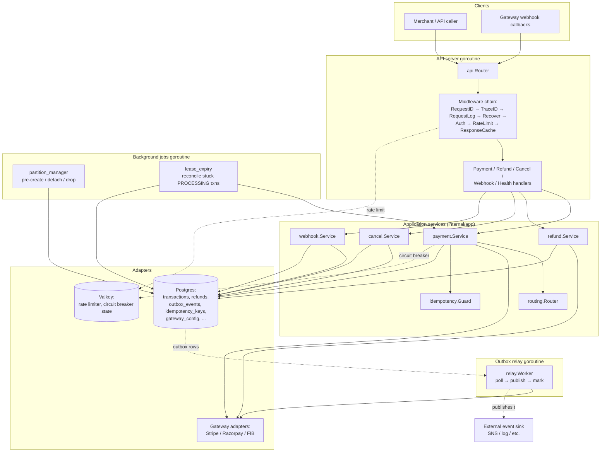
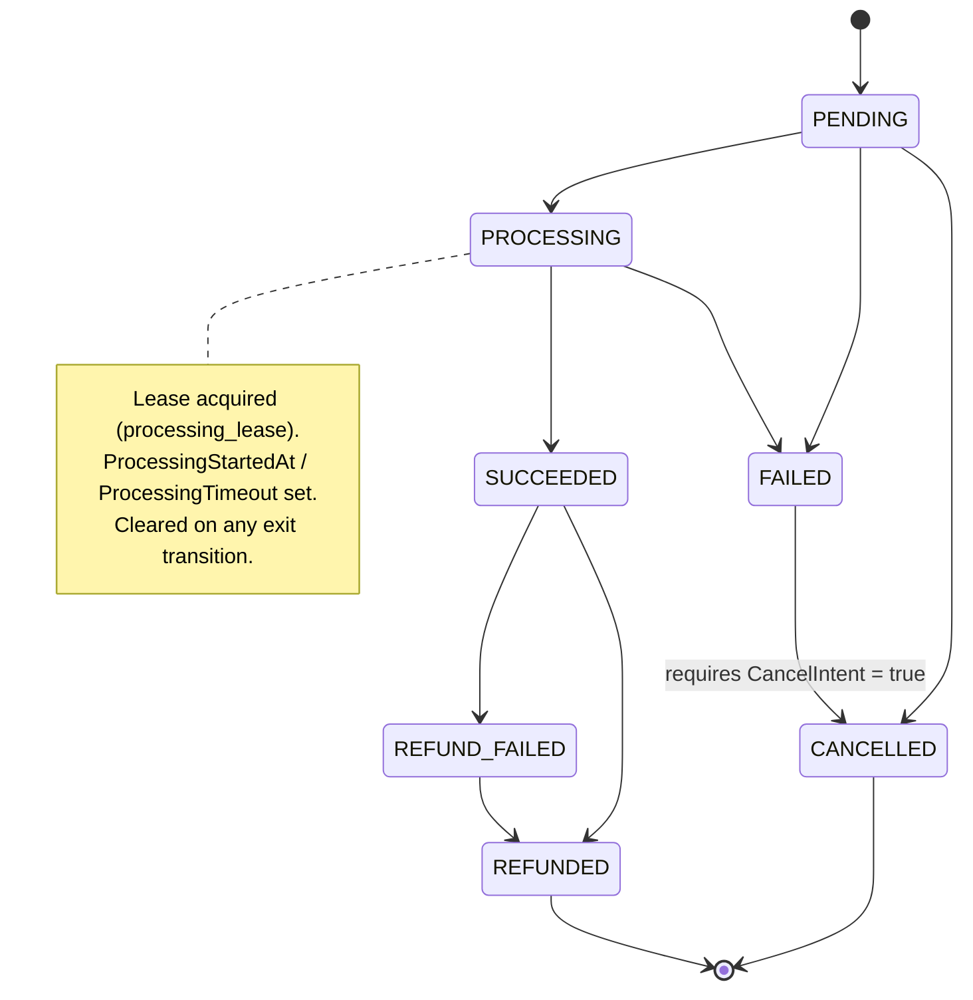
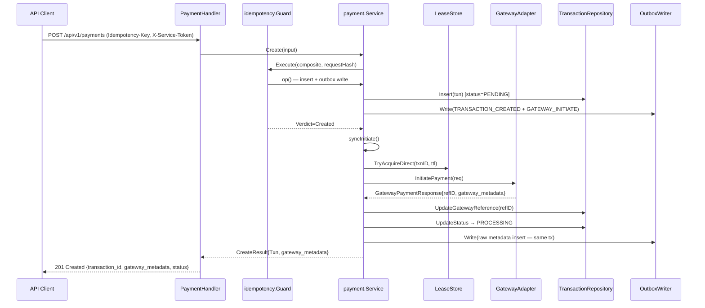
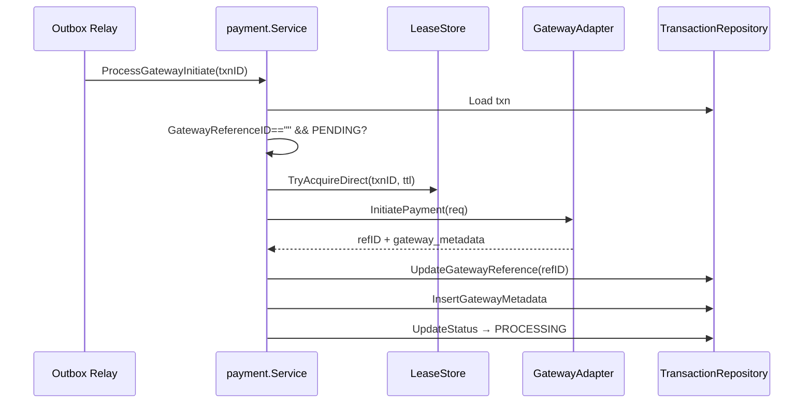
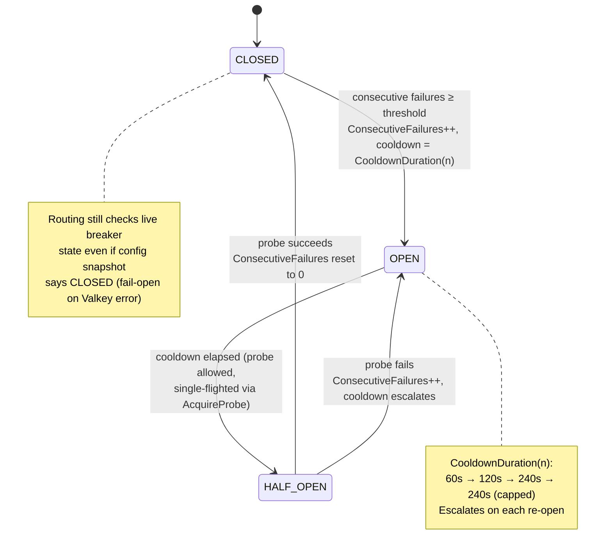
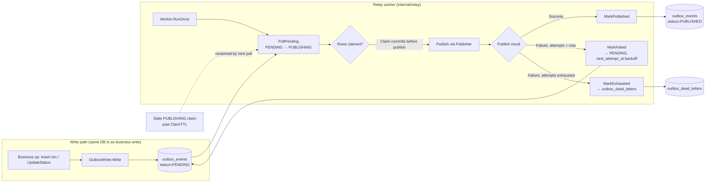
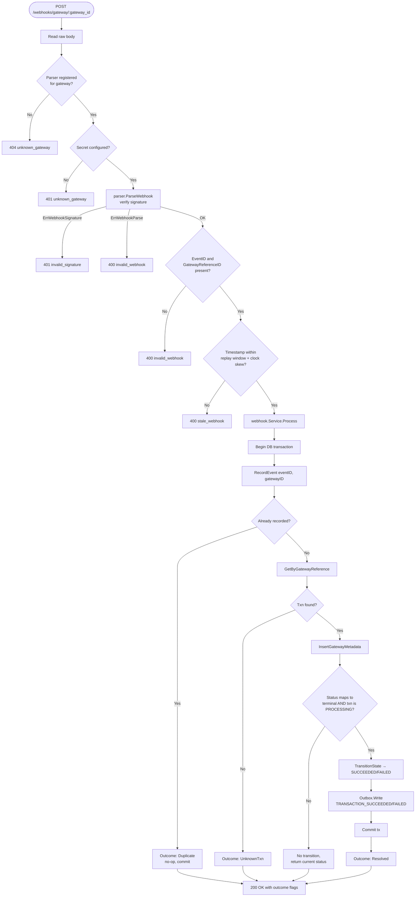
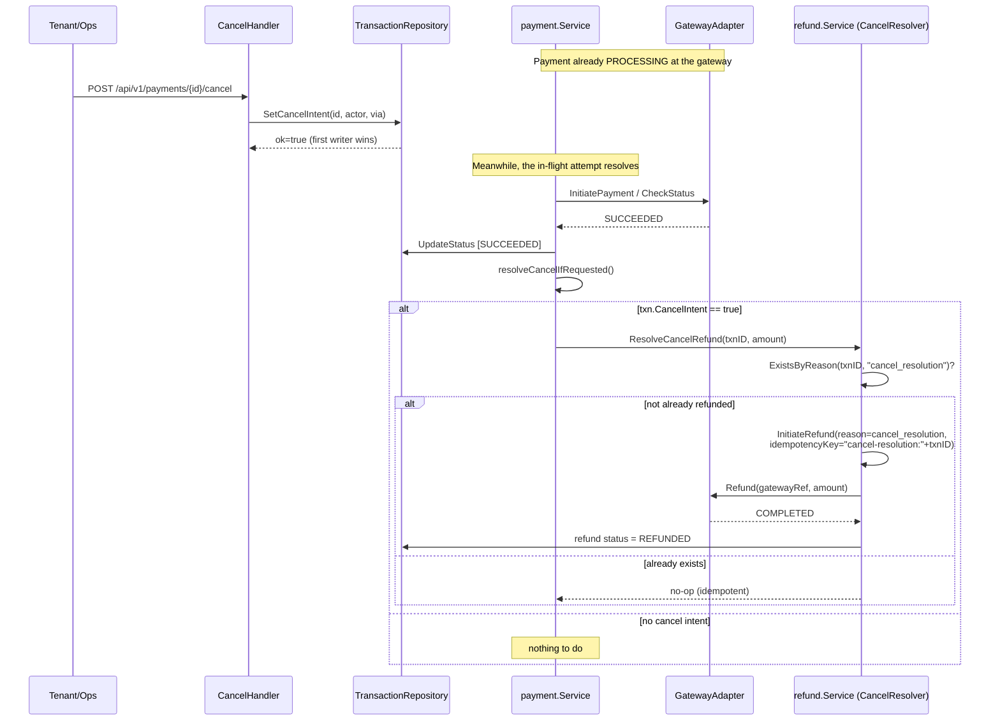
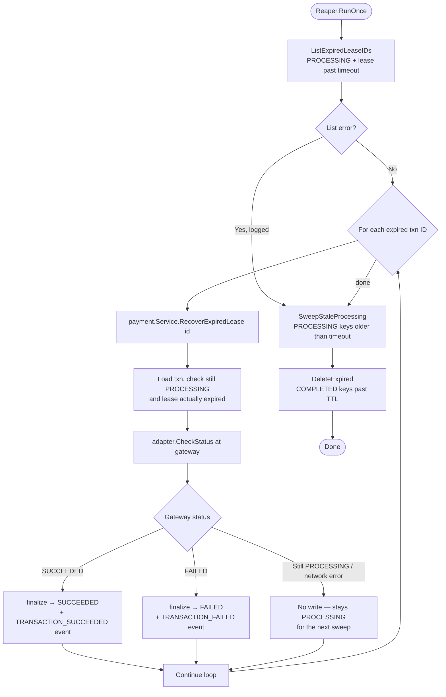
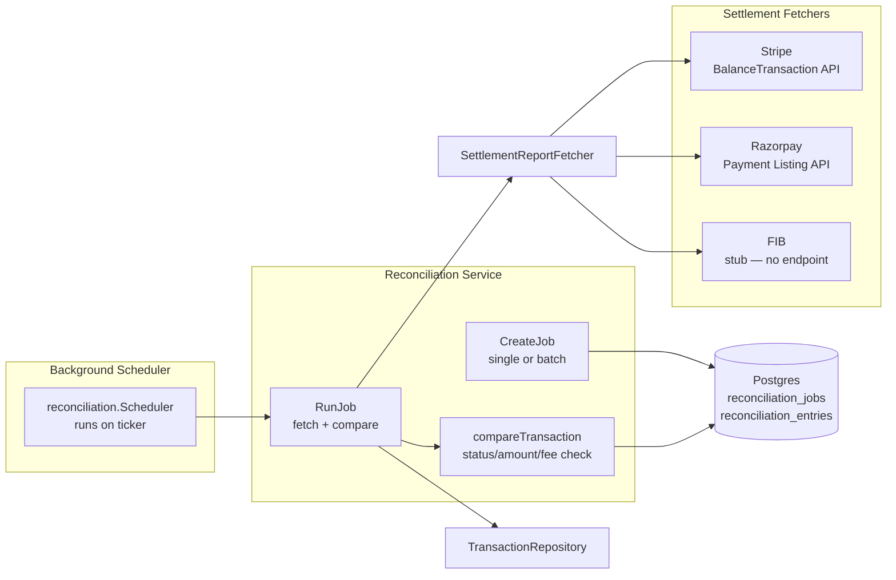

# Payment Service

A SaaS multitenant payment processing service supporting multiple gateways (Stripe, Razorpay, FIB), written in Go using a hexagonal (ports-and-adapters) architecture. Each tenant independently configures its gateway credentials (stored encrypted), and callers select an explicit gateway per request. The service exposes tenant-scoped gateway management, payment creation, refunds, cancellations, inbound gateway webhooks, and the reliability infrastructure (outbox, idempotency, circuit breakers, lease recovery) needed to run payments safely at scale.

This document describes the architecture, the core domain logic, and the operational processes underneath, with diagrams for each major flow.

---

## Table of Contents

- [1. Overview](#1-overview)
- [2. Architecture](#2-architecture)
- [3. Project Layout](#3-project-layout)
- [4. Core Domain: The Transaction Lifecycle](#4-core-domain-the-transaction-lifecycle)
- [5. Creating and Processing a Payment](#5-creating-and-processing-a-payment)
- [6. Gateway Selection](#6-gateway-selection)
- [7. Gateway Error Handling](#7-gateway-error-handling)
- [8. Circuit Breaker](#8-circuit-breaker)
- [9. Idempotency](#9-idempotency)
- [10. Transactional Outbox and Relay](#10-transactional-outbox-and-relay)
- [11. Inbound Webhooks](#11-inbound-webhooks)
- [12. Refunds and Cancellation](#12-refunds-and-cancellation)
- [13. Lease-Expiry Reaper](#13-lease-expiry-reaper)
- [14. Partition Management](#14-partition-management)
- [15. Rate Limiting](#15-rate-limiting)
- [16. Authentication and Authorization](#16-authentication-and-authorization)
- [17. Transport Security (mTLS)](#17-transport-security-mtls)
- [18. Field-Level Encryption](#18-field-level-encryption)
- [19. Observability](#19-observability)
- [20. API Reference](#20-api-reference)
- [21. Configuration](#21-configuration)
- [22. Running Locally](#22-running-locally)
- [23. Fee System](#23-fee-system)
- [24. Reconciliation](#24-reconciliation)
- [25. Testing](#25-testing)

---

## 1. Overview

The service runs as a **single process** (`cmd/server`) that spawns all three concerns as goroutines sharing the same database and Valkey connections:

| Goroutine | Responsibility |
|---|---|
| **API server** | HTTP server: create/process payments, refunds, cancellations, receive gateway webhooks, health checks, reconciliation management |
| **Outbox relay** | Polls the transactional outbox and publishes domain events downstream |
| **Background jobs** | Runs `partition_manager`, `lease_expiry`, `gateway_metrics`, `tenant_webhook`, `notification`, and `reconciliation` on tickers (immediate first run, then periodic) |

A single `SIGINT` / `SIGTERM` propagates through a shared context so all three shut down together.

Supported payment gateways: **Stripe**, **Razorpay**, **FIB** (`internal/adapters/gateways/*`), each behind a common `ports.GatewayAdapter` interface so the core payment/refund logic is gateway-agnostic.

Supported payment methods: card, UPI, netbanking, wallet (varies by gateway capability).

Key reliability properties the service is built around:

- **No lost writes**: every state change that must also emit an event does so inside one DB transaction via the **transactional outbox** pattern.
- **No duplicate side effects**: idempotency is enforced both at the HTTP layer (whole-response caching) and the business layer (`idempotency.Guard`), plus a DB-level advisory lock on the parent transaction for refund sums.
- **No double-charging on ambiguous gateway failures**: the fallback logic distinguishes "definitely declined" (safe to retry elsewhere) from "unknown, maybe charged" (never retried automatically).
- **Self-healing on stuck payments**: a background reaper reconciles any transaction whose processing lease expired without a resolution.

---

## 2. Architecture



The design follows **hexagonal architecture**:

- `internal/domain/` — pure business rules with no I/O: the transaction state machine (`Txn`), refund invariants (over-refund protection), routing scoring, circuit breaker state machine.
- `internal/app/` — use-case orchestration: takes domain objects and ports (interfaces), coordinates transactions, calls gateways, writes outbox events.
- `internal/ports/` — interfaces the app layer depends on (`GatewayAdapter`, `Logger`, `MetricRecorder`, `OutboxWriter`, `ConfigStore`, …), so the app layer never imports a concrete adapter.
- `internal/adapters/` — concrete implementations: Postgres repositories, Valkey rate limiter/circuit-breaker store, gateway HTTP clients, TLS manager, envelope encryption, slog-based logger.
- `internal/api/` — HTTP-specific concerns: routing, middleware, request/response DTOs.

---

## 3. Project Layout

```
cmd/server/        Single binary entrypoint: API server, relay, and background jobs
config/            Environment-variable driven configuration + validation (viper)
internal/
  domain/
    transaction/   Txn entity + state machine
    refund/        Refund entity + over-refund guard
    gateway/       Circuit breaker state machine, discrepancy metrics
    fees/          Fee calculation: nested breakdown (summary + fees + exchange + gateway)
    reconciliation/ Job + Entry entities, mismatch types, auto-resolution config
  app/
    payment/       Create, ProcessPayment, ProcessGatewayInitiate, GetGatewayMetadata, RecoverExpiredLease
    refund/        InitiateRefund, ProcessRefund, ResolveCancelRefund
    cancel/        Cancel intent handling
    webhook/       Inbound webhook → transaction resolution
    idempotency/   Reserve/Lookup/Complete guard used by payment & refund
    reconciliation/ Reconciliation orchestration: compare transactions against gateway settlement reports
  adapters/
    postgres/      Repositories, migrations-backed queries, Transactor
    valkey/        Rate limiter (token bucket, Lua), circuit breaker store
    gateways/      stripe/, razorpay/, fib/ adapters + webhook parsers + settlement fetchers
    security/      mTLS certificate manager
    encryption/    Envelope encryption (KMS-style key manager)
    observability/ slog logger with field redaction, OTel metrics
    sns/           AWS SNS publisher
  api/
    handlers/      HTTP handlers (payment, refund, cancel, webhook, health, pay, reconciliation)
    middleware/    Auth, RateLimit, RequestID, TraceID, RequestLog, Recover
  jobs/
    partition_manager/  Weekly outbox partition lifecycle
    lease_expiry/       Stuck-transaction reaper + idempotency-key sweep
    gateway_metrics/    Circuit breaker + latency metrics persistence
    tenant_webhook/     Outbound webhook delivery with retry
    notification/       Email/SMS queue processor
    reconciliation/     Background settlement reconciliation scheduler
  relay/           Generic outbox polling worker + publisher interface
  ports/           All interfaces + shared types (GatewayAdapter, Logger, ...)
  testsupport/     Shared Postgres/Valkey test harness
test/integration/  End-to-end tests exercising real Postgres/Valkey
web/               Embedded static files + checkout templates
```

---

## 4. Core Domain: The Transaction Lifecycle

Every payment is represented by a `Txn` with a strictly enforced state machine (`internal/domain/transaction/state_machine.go`). Invalid transitions return `ErrInvalidTransition` rather than silently mutating state, and transitions out of `PROCESSING` clear the processing lease fields.



Notable rules baked into `transaction.go` / `state_machine.go`:

- `PENDING`, `PROCESSING`, `SUCCEEDED`, `FAILED`, `CANCELLED`, `REFUNDED`, `REFUND_FAILED` are the only statuses (`AllStatuses()`).
- `IsTerminal()` is true for `SUCCEEDED`, `CANCELLED`, `REFUNDED`, `REFUND_FAILED` — note that `SUCCEEDED` is terminal for the *payment* even though a refund can still be attached afterward.
- A transaction carries `Version` for **optimistic locking**: `UpdateStatus` fails with `ErrVersionConflict` if the stored version doesn't match, and `ErrNotFound` (a distinct case) if the row simply doesn't exist.
- `AttemptedGateway` vs `ActualGateway` are tracked separately so a fallback to a different gateway is visible (`HasGatewayDiscrepancy()`).

---

## 5. Creating and Processing a Payment

The payment flow is a **single-step** synchronous call: `POST /api/v1/payments` creates the transaction, synchronously calls the gateway's `InitiatePayment`, and embeds the gateway-specific output (`gateway_metadata`) in the response. The browser then renders FIB's QR code, Stripe's card form, or Razorpay's checkout button directly from the embedded metadata — no second API call needed.

### Step 1: Create + Initiate (single API call)

`POST /api/v1/payments` (service token, `Idempotency-Key` required) creates a transaction in `PENDING` state, calls the gateway's `InitiatePayment`, transitions to `PROCESSING`, and returns the gateway-specific output in `gateway_metadata`. A `GATEWAY_INITIATE` outbox event is also written as a fallback retry.



Key implementation details:

- **`Idempotency-Key` is mandatory** on `POST /api/v1/payments` and `POST /api/v1/payments/{id}/refunds`. It's combined with `tenantID + operation` into a composite hash (`idempotency.Composite`), and the request body is hashed (`idempotency.RequestHash`) to detect key reuse with a different payload (→ `409 idempotency_key_reused`).
- **The processing lease** (`processing_lease` table, `LeaseStore.TryAcquireDirect`) prevents two concurrent `ProcessGatewayInitiate` calls from both calling the gateway. If the lease isn't acquired, the event is skipped (the other instance will handle it).
- **`EstimatedTimeoutSeconds`** comes from `ConfigStore.GetProcessingTimeout(gateway, method)` and becomes the lease TTL — it must be positive or transaction creation fails.
- If `syncInitiate` errors (e.g. gateway adapter unavailable), the handler returns **`500`** with the transaction in `PENDING` state. The caller can retry with the same idempotency key (→ `200 Replayed`), and the outbox relay will eventually process the `GATEWAY_INITIATE` event as a fallback. The `GATEWAY_INITIATE` outbox event handler (`ProcessGatewayInitiate`) is idempotent — if the gateway reference already exists, it's a no-op.
- `gateway_metadata` contains gateway-specific output (e.g. `client_secret` for Stripe, `qr_code`/`readable_code`/`valid_until` for FIB, `order_id`/`key_id` for Razorpay) and is persisted in the `transaction_gateway_metadata` table for later retrieval.
- `PublishableKey` is included in `gateway_metadata` for Stripe and Razorpay so the browser can initialize the gateway SDK without a separate config call.

### Step 2: Complete payment via checkout page

The browser opens the checkout page at `GET /pay/{transaction_id}?token={token}`. The page renders gateway-specific UI based on `gateway_metadata`:

- **FIB**: QR code with app links and countdown timer
- **Stripe**: Card form (Stripe Elements) mounted via Stripe.js — user enters card details, `confirmCardPayment` sends them directly to Stripe
- **Razorpay**: "Pay with Razorpay" button that opens the Razorpay checkout modal

The page subscribes to SSE at `GET /api/v1/payments/{id}/events?token={token}` for real-time status updates. If SSE fails, it falls back to polling `GET /api/v1/payments/{id}?token={token}` every 5 seconds. After 30 seconds without a terminal event, a timeout message is shown with a reload button.

### Step 2a: Outbox-initiated retry (fallback)

If the synchronous `syncInitiate` fails within `Create`, the `GATEWAY_INITIATE` outbox event written during insertion will be picked up by the outbox relay. The initiator handler calls `ProcessGatewayInitiate` which:

1. Acquires a processing lease (cross-instance dedup)
2. Calls the gateway's `InitiatePayment`
3. Updates `GatewayReferenceID` and transitions to `PROCESSING`
4. Inserts `gateway_metadata`

`ProcessGatewayInitiate` is idempotent: if `GatewayReferenceID != ""` or status is not `PENDING`, it returns nil (no-op). This ensures the sync path and the relay path don't conflict — whichever runs first succeeds.



---

## 6. Gateway Selection

The payment path uses the **explicit `gateway_id`** from the caller's request.

Each tenant configures which gateways they have credentials for via the tenant gateway config API (`/api/v1/tenants/{tenant_id}/gateways`). The caller discovers available gateways via `GET /api/v1/gateways` (optionally filtered by `?payment_method=`) and passes the chosen `gateway_id` in the payment request.

`GET /api/v1/gateways` returns:
```json
[
  {
    "gateway_id": "stripe",
    "display_name": "Stripe",
    "is_active": true,
    "supported_methods": ["card"],
    "supported_currencies": ["USD", "BDT"]
  }
]
```

Gateways whose circuit breaker is **OPEN** are excluded from this listing. If the Valkey breaker store is unreachable the gateway is included (fail-open — safe degradation).

---

## 7. Gateway Error Handling

A single gateway call is made per payment attempt. The error category determines the outcome:

- **`HardDecline`** (e.g. `card_declined`, `expired_card`): the card/account was genuinely rejected. Terminal `FAILED` immediately. Counts as a circuit breaker success (the gateway is healthy).
- **`SoftDecline`** (e.g. `insufficient_funds`, `try_again_later`): plausibly transient. Terminal `FAILED` for the synchronous attempt; the caller may retry with a new idempotency key.
- **`NetworkTimeout` / `Ambiguous`**: the request may or may not have reached the gateway. The transaction is left **non-terminal** (`PROCESSING`) — the lease-expiry reaper (§13) later calls `CheckStatus` to resolve it definitively.
- **`GatewayError`** (5xx / unexpected): finalised as `FAILED` for the synchronous attempt, but counts as a circuit breaker failure.

Circuit breaker recording: `NetworkTimeout`, `GatewayError`, and `Ambiguous` count as failures; `HardDecline` and `SoftDecline` do not.

---

## 8. Circuit Breaker

`internal/domain/gateway` defines the state machine; `internal/adapters/valkey.CircuitBreakerStore` persists it atomically via Lua scripts (`RecordFailure`, `RecordSuccess`, `Transition`) so concurrent API instances agree on state without races.



- **Cooldown escalation**: `CooldownDuration(n)` doubles per consecutive failure (60s, 120s, 240s), capped at 240s, so a gateway that keeps failing right after being re-enabled gets progressively longer timeouts instead of hammering it every 60 seconds.
- **Single-flighted probing**: `AcquireProbe` uses a Valkey `SETNX` so that when a breaker's cooldown has elapsed, only one in-flight request is allowed to "probe" the gateway (routed as if `HALF_OPEN`) while others still treat it as unavailable — avoiding a thundering herd hitting a gateway the moment its cooldown lapses.
- **Fail-open on Valkey outage**: if the breaker store itself is unreachable, `Router.liveBreakerState` falls back to the last-known state from the config snapshot rather than blocking all routing decisions on Valkey being up.
- Only `CLOSED → OPEN`, `OPEN → HALF_OPEN`, and `HALF_OPEN → {CLOSED, OPEN}` are legal; anything else (e.g. `CLOSED → HALF_OPEN` directly) is rejected by the transition script.
- **Gateway discovery respects circuit breaker state**: `GET /api/v1/gateways` filters out gateways whose Valkey circuit breaker state is non-routable (OPEN). This prevents callers from selecting an unhealthy gateway at checkout time. On Valkey error the gateway is included (fail-open).

---

## 9. Idempotency

Idempotency is enforced at **two layers**, both following the same Reserve → run-or-lookup → Complete shape:

1. **HTTP layer** (`middleware.Idempotency`): caches the *entire HTTP response* (status + body) keyed by `tenant + method + path + Idempotency-Key`, scoped per tenant so two different tenants can safely reuse the same key string.
2. **Business layer** (`app/idempotency.Guard`): used inside `payment.Service.Create` and `refund.Service.InitiateRefund` to guard the underlying domain operation itself (insert + outbox write), independent of how it's invoked.


Four possible verdicts, mapped to distinct HTTP outcomes by the handlers:

| Verdict | Meaning | HTTP response |
|---|---|---|
| `Created` | First time seeing this key; op ran | `201 Created` |
| `Replayed` | Op already completed; cached response returned | `200 OK` |
| `InProgress` | Another request with this key is still running | `409 idempotency_in_progress` |
| `KeyReused` | Same key, different request body | `409 idempotency_key_reused` |

A failed op **rolls back the reservation** (the whole guard runs inside `Transactor.WithinTx`), so a request that errors midway doesn't permanently strand the key — a retry can claim it fresh. At the HTTP layer specifically, a `5xx` response is deliberately **not cached** and the reservation is released, for the same reason.

---

## 10. Transactional Outbox and Relay

Every state change that needs to notify the outside world writes an `outbox_events` row **inside the same database transaction** as the state change itself (`OutboxWriter.Write` requires an ambient tx via `WithTx`). This guarantees the event is never lost (it's part of the same atomic commit) and never emitted for a change that didn't actually persist (it's rolled back together).



Design points that matter operationally:

- **Claim-before-publish, not select-then-publish**: `PollPending` atomically transitions matched rows `PENDING → PUBLISHING` (or reclaims stale `PUBLISHING` rows past `ClaimTTL`, default 60s) and *commits that claim* before the caller ever calls `Publish`. An earlier design that used `SELECT ... FOR UPDATE SKIP LOCKED` without committing the claim first would let two relay workers both fetch and publish the same event, since the row lock released at commit time — after publishing, not before.
- **Backoff on failure**: a failed publish sets `next_attempt_at` using exponential backoff (`Worker.backoff`, base × 2^attempts, capped at `MaxBackoff`) and returns the event to `PENDING` for retry, up to `MaxAttempts` (default 5).
- **Dead-lettering**: once attempts are exhausted, `MarkExhausted` moves the event to `outbox_dead_letters` in the same transaction it removes/marks the original — replayable later via `ReplayDeadLetter`, which re-enqueues a **new** event ID rather than resurrecting the old one.
- **Shard-aware polling**: `PollPending(shardMin, shardMax, ...)` lets multiple relay workers split the keyspace so they don't compete for the same rows, without needing external partitioning of workers.
- **Weekly partitioning**: `outbox_events` itself is a partitioned table (see §14) so old, fully-published partitions can be detached and dropped instead of bloating one ever-growing table.

---

## 11. Inbound Webhooks

`POST /webhooks/gateway/{gateway_id}` receives asynchronous status updates from gateways and reconciles them against the internal transaction record.



Security and correctness details:

- **Per-gateway signature verification** is delegated to each adapter's `ParseWebhook` (`GatewayWebhookParser`): Stripe verifies an HMAC-SHA256 over `timestamp.body` and rejects payloads outside a 300-second tolerance window; Razorpay verifies an HMAC-SHA256 header signature; FIB parses the raw JSON payload (`{id, paymentId, status}`) without signature verification (webhook secret is per-tenant from encrypted DB config).
- **Duplicate delivery is a no-op, not an error**: gateways commonly redeliver webhooks; `RecordEvent` uses a unique constraint on `(event_id, gateway_id)` so a redelivery is detected and short-circuited before any transaction mutation, still returning `200 OK`.
- **Only `PROCESSING` transactions are mutated**, and only for a status that maps to a terminal outcome (`succeeded/success/captured/paid` → `SUCCEEDED`; `failed/failure` → `FAILED`). A webhook arriving for an already-terminal or non-`PROCESSING` transaction is accepted but causes no transition — this prevents a stale or out-of-order webhook from clobbering a status that a different code path (e.g. the reaper) already resolved.
- **Timestamp/replay-window check** (`checkTimestamp`) is optional per gateway (`ConfigStore.WebhookPolicy`) and only enforced if the gateway sends an `X-Webhook-Timestamp` header.

---

## 12. Refunds and Cancellation

### Refund invariants

`domain/refund.New` refuses to construct a refund that would push `alreadyRefunded + amount` past the original transaction amount, returning a typed `ErrOverRefund` — checked against a `SELECT ... FOR UPDATE`-style lock on the parent transaction (`LockParentTransaction`) so concurrent refund requests can't race past the cap.

Refund gateway outcomes follow the same "don't guess on ambiguity" principle as payments: a `GatewayError`/`NetworkTimeout`/`Ambiguous` response leaves the refund in `REFUND_PROCESSING` rather than declaring `REFUND_FAILED` (which would invite an unsafe retry that could double-refund).

### Cancel-intent race with a still-succeeding payment

The most interesting correctness case in the service: a tenant/ops cancel request can land *while a payment is still in flight at the gateway*. If the gateway ends up honoring the payment anyway, the service must notice and auto-refund exactly once.



Why this is safe under concurrency:

- **`SetCancelIntent`** is a single conditional `UPDATE` — only the first caller for a given transaction wins (`TestCancel_ConcurrentSingleIntent` proves exactly one winner under 16 concurrent callers), and it's a no-op on already-terminal transactions (`CancelService.Cancel` returns `ALREADY_TERMINAL` without writing).
- **`ResolveCancelRefund` is doubly idempotent**: it checks `ExistsByReason(txnID, "cancel_resolution")` before initiating anything, *and* the refund itself is initiated with a deterministic idempotency key (`"cancel-resolution:" + txnID`), so even if the finalize path somehow ran twice (e.g. reaper + synchronous path both resolving the same lease), only one `cancel_resolution` refund is ever created.
- **`FAILED → CANCELLED` still requires `CancelIntent`** at the state-machine level (§4) — cancellation is never implicit, it's always driven by an explicit recorded intent.

---

## 13. Lease-Expiry Reaper

A payment that got stuck `PROCESSING` — because the synchronous attempt hit a `NetworkTimeout`/`Ambiguous`/`GatewayError` and correctly declined to guess — needs something to eventually resolve it. That's the `lease_expiry` job, wired as a periodic goroutine inside the single process (runs immediately at startup, then on a configurable interval).



- **Status-check, never a blind retry**: `RecoverExpiredLease` calls `CheckStatus` (a read-only query against the gateway) rather than re-attempting `InitiatePayment`, so it can never create a duplicate charge — it only ever finds out what already happened and records that truth.
- **One failure doesn't abort the batch**: each transaction ID is recovered independently; a single recovery error is logged and the loop continues to the rest (`TestReaper_PerItemFailureDoesNotAbortSweep`).
- **Piggy-backed idempotency-key hygiene**: the same run also sweeps `idempotency_keys` rows — `PROCESSING` rows older than `IdempotencyProcessingTimeout` (default 5 minutes, meaning a crashed request that never called `Complete`/rolled back cleanly) are cleared so retries aren't blocked forever, and `COMPLETED` rows past their TTL are purged to bound table growth.

---

## 14. Partition Management

`outbox_events` is partitioned **weekly** (`outbox_YYYY_Wnn`, ISO week numbering) to keep the hot table small and make old data cheap to age out. The `partition_manager` job (running as a periodic goroutine inside the single process) maintains this on a schedule.

Responsibilities, all guarded by a single Postgres advisory lock (`AcquireLock`/`ReleaseLock`) so only one instance does this work at a time even if the job is scheduled redundantly:

1. **Pre-create ahead**: creates partitions for the current ISO week plus `WeeksAhead` (default 2) weeks in advance, so writes never land in a fallback `outbox_default` partition due to a missing partition.
2. **Detach stale, empty partitions**: a partition older than `RetentionWeeks` (default 2) is detached **only if** `CountUnpublished` reports zero pending/failed rows in it — a partition that still has unpublished events is left alone regardless of age, so the relay always has something to poll.
3. **Drop after a grace period**: partitions detached more than `DropAfter` (default 14 days) ago are physically dropped, giving a window to notice a mistake before data is gone for good. Every detach/drop is also recorded via `LogAction` for an audit trail.

---

## 15. Rate Limiting

`internal/adapters/valkey.RateLimiter` implements a **token-bucket** algorithm executed atomically in Valkey via a Lua script (`scripts/token_bucket.lua`), keyed on three independent dimensions simultaneously — user, tenant, and IP — so exhausting one dimension's bucket doesn't consume tokens from the others.

- **Local in-memory fallback**: if Valkey is unavailable for `failureThreshold` (3) consecutive calls, the limiter flips to a local, per-process token bucket sized at `capacity × FallbackMultiplier` (default 0.5 — deliberately more conservative than the Valkey-backed limit), backed by an LRU (`container/list`) capped at `LocalMaxBuckets` to bound memory. A background health check restores the Valkey-backed path once it recovers.
- **Merchant bucket key comes from the authenticated principal**, never a client-supplied header — `tenantBucketID` reads from request context (set by the auth middleware), so a spoofed `X-Tenant-ID` header can't be used to attribute load to (or rate-limit) a different tenant.
- Rejections return `429` with a computed `Retry-After` header (minimum 1 second).

---

## 16. Authentication and Authorization

The service uses two independent auth layers depending on caller type.

### API callers (service tokens)

Configured via environment variables:

- **Service tokens** (`X-Service-Token`) map to a specific `TenantID` and `UserID` — the tenant identity is *bound to the token*, not read from any request header, which is what makes the rate-limiter tenant-key spoofing protection in §15 possible.
- **Ops tokens** (`X-Ops-Token`) grant the `ops` role without a tenant binding (used for cancel/refund operational actions).

Tokens are stored hashed (SHA-256) in memory.

### Browser callers (checkout token)

Browser-facing paths are exempt from service-token auth. Instead, a per-transaction **checkout token** is generated at payment creation time (`POST /api/v1/payments`) and returned in the `token` response field. The browser presents this token on every subsequent call via the `pay/` paths:

| Path | Token location |
|---|---|
| `GET /pay/{transaction_id}` | `?token=` query param |
| `GET /api/v1/payments/{id}` | `?token=` query param |
| `GET /api/v1/payments/{id}/events` | `?token=` query param |

The token is a 32-byte cryptographically random value (SHA-256 hashed on the transaction row). It is valid for the lifetime of the `PENDING` transaction and requires no service token.

### Exempt path summary

| Path | Auth |
|---|---|
| `GET /health` | None |
| `POST /webhooks/*` | Gateway signature |
| `GET /pay/*` | Checkout token |
| `POST /api/v1/payments` (service token) | **Service token required** |
| `GET /api/v1/payments/{id}` | Service token **or** checkout token |
| `GET /api/v1/payments/{id}/events` | Service token **or** checkout token |
| All other `/api/v1/*` | Service / ops token required |

---

## 17. Transport Security (mTLS)

`internal/adapters/security.Manager` wraps Go's `crypto/tls` to support mutual TLS with **hot certificate rotation**:

- Loads the server keypair and (optionally) a client-CA pool; if `MtlsStrictMode` is enabled, unauthenticated/untrusted client certificates are rejected (`RequireAndVerifyClientCert`), otherwise client certs are verified only if presented (`VerifyClientCertIfGiven`).
- `StartRefresh(ctx)` runs a background ticker (`CertRefreshIntervalSec`) that reloads the certificate and CA pool from disk without restarting the process — new connections pick up the rotated cert immediately via `GetConfigForClient`, existing connections are unaffected.
- If `TLS_CERT_FILE` isn't configured, the server runs plain HTTP (suitable for local dev or when TLS is terminated upstream, e.g. behind a load balancer).

---

## 18. Field-Level Encryption

`internal/adapters/encryption` implements **envelope encryption** for sensitive fields (not currently wired into a specific column in the shown code, but available as infrastructure):

- A `KeyManager` (local AES-GCM implementation provided; swappable for a real KMS) generates and unwraps per-use **data encryption keys (DEKs)**, each wrapped under a master key with the key ID bound as authenticated-associated-data (AAD) — so a DEK wrapped under one key ID can never be unwrapped under a different one, even with the same master key.
- `Envelope` caches a current DEK and reuses it across encryptions up to `MaxDEKUses` (default ~1M) or `DEKTTL` (default 1h), whichever comes first, avoiding a KMS round-trip per encryption while still rotating regularly.
- A separate **decrypt-side cache** (`dekCache`, keyed by a hash of the wrapped DEK, TTL default 1h) avoids re-unwrapping the same DEK repeatedly when decrypting many records that share it.
- All ciphertext is authenticated (AES-GCM) and bound to caller-supplied AAD (e.g. `"transaction:card:tx-1"`), so ciphertext can't be replayed into a different field/record context even by an attacker who can write to the database.

---

## 19. Observability

- **Structured logging** (`internal/adapters/observability.SlogLogger`) wraps `log/slog` with a custom `TRACE` level below `DEBUG`, and **automatically redacts** known-sensitive field keys (`vpa`, `card_number`, `pan`, `cvv`, `card_cvv`, `token`, `api_key`, `client_secret`, `secret`, `password`, `authorization`, `access_token`, `refresh_token`, `private_key` — case-insensitive) to `<redacted>` before they're ever written to output.
- **Error-log contract enforcement**: `Logger.Error` checks for required fields (`error_code`, `trace_id`, `transaction_id`) on every call and appends a `log_validation_error` note if any are missing — a lightweight guardrail against error logs that are hard to correlate later, without failing the call itself.
- **Metrics**: a `MetricRecorder` port is defined with counters/histograms/gauges for transaction outcomes, gateway fallback/circuit-breaker events, outbox publish latency/failures, and rate-limiter fallback activity (see `internal/ports/metrics.go` for the full catalog); the shipped implementation (`NewNoopMetrics`) is a no-op, ready to be swapped for a real backend (StatsD/Prometheus/etc.).

---

## 20. API Reference

| Method | Path | Auth | Description |
|---|---|---|---|
| `GET` | `/health` | none | DB + Valkey connectivity check |
| `GET` | `/pay/{transaction_id}` | checkout token (`?token=`) | Checkout page (FIB QR, Stripe card form, Razorpay button based on `gateway_metadata`) |
| `GET` | `/pay/success` | checkout token (`?token=`) | Payment success landing page |
| `GET` | `/pay/failure` | checkout token (`?token=`) | Payment failure landing page |
| `GET` | `/api/v1/gateways` | service/ops token | List available gateways (optional `?payment_method=` filter) |
| `POST` | `/api/v1/payments` | service token | Create transaction + initiate gateway payment (single step). Requires `Idempotency-Key`. Returns `transaction_id`, `gateway_metadata`, `fee_breakdown`, `status`, `token`. On sync initiate failure => 500 (retry with same idempotency key). |
| `GET` | `/api/v1/payments/{id}` | service/ops or checkout token (`?token=`) | Fetch a transaction by ID (includes `fee_breakdown`, `gateway_amount`, `gateway_currency`) |
| `POST` | `/api/v1/payments/{id}/refunds` | service/ops token | Initiate + immediately attempt a refund. Requires `Idempotency-Key`. |
| `POST` | `/api/v1/payments/{id}/cancel` | service/ops token | Request cancellation (idempotent; safe on already-terminal transactions) |
| `GET` | `/api/v1/payments/{id}/events` | service/ops or checkout token (`?token=`) | SSE stream of transaction status changes |
| `GET` | `/api/v1/tenants/{tenant_id}/gateways` | service/ops token | List a tenant's gateway configurations |
| `GET` | `/api/v1/tenants/{tenant_id}/gateways/{gateway_id}` | service/ops token | Get a single tenant gateway config |
| `POST` | `/api/v1/tenants/{tenant_id}/gateways` | service/ops token | Create or update a tenant gateway config |
| `DELETE` | `/api/v1/tenants/{tenant_id}/gateways/{gateway_id}` | service/ops token | Delete a tenant gateway config |
| `POST` | `/webhooks/gateway/{gateway_id}` | gateway signature | Inbound gateway status callback (uses `?transaction_id=` query param for tenant resolution) |
| `POST` | `/api/v1/reconciliation/jobs` | service/ops token | Create a reconciliation job (single-transaction or batch by period) |
| `GET` | `/api/v1/reconciliation/jobs` | service/ops token | List reconciliation jobs (filter by `?gateway_id=`, `?status=`) |
| `GET` | `/api/v1/reconciliation/jobs/{id}` | service/ops token | Get a single reconciliation job |
| `POST` | `/api/v1/reconciliation/jobs/{id}/run` | service/ops token | Execute a pending reconciliation job |
| `GET` | `/api/v1/reconciliation/jobs/{id}/entries` | service/ops token | List reconciliation entries for a job (filter by `?mismatch_type=`, `?resolution_status=`) |
| `POST` | `/api/v1/reconciliation/jobs/{id}/entries/{entry_id}/resolve` | service/ops token | Mark a reconciliation entry as resolved |

### Request/Response Examples

**Create Payment:**
```http
POST /api/v1/payments
X-Service-Token: test-token
Idempotency-Key: payment-unique-key
Content-Type: application/json

{
  "gateway_id": "stripe",
  "amount": 50000,
  "currency": "BDT",
  "payment_method": "card",
  "customer_id": "33333333-3333-3333-3333-333333333333",
  "customer_email": "buyer@example.com",
  "description": "Order #1234",
  "metadata": { "order_id": "ORD-1234" },
  "callback_url": "https://example.com/callback",
  "redirect_url": "https://example.com/redirect"
}
```

**Response (Stripe):**
```json
{
  "success": true,
  "data": {
    "transaction_id": "txn-uuid",
    "status": "PROCESSING",
    "token": "checkout-token",
    "gateway_metadata": {
      "client_secret": "pi_xxx_secret_yyy",
      "publishable_key": "pk_test_xxx"
    },
    "fee_breakdown": {
      "summary": { "amount": 50000, "fees": 1750, "total": 51750, "currency": "BDT" },
      "fees": { "service_fee": 1250, "fixed_charge": 500, "total": 1750 },
      "gateway": { "amount": 51750, "currency": "BDT" }
    },
    "gateway_amount": 51750,
    "gateway_currency": "BDT"
  },
  "request_id": "req-uuid",
  "timestamp": "2026-01-01T00:00:00.000000000Z"
}
```

**Response (FIB):**
```json
{
  "success": true,
  "data": {
    "transaction_id": "txn-uuid",
    "status": "PROCESSING",
    "token": "checkout-token",
    "gateway_metadata": {
      "qr_code": "data:image/png;base64,...",
      "readable_code": "FIB-ABC123",
      "personal_app_link": "https://fib.app/pay/...",
      "business_app_link": "https://fib.app/business/...",
      "corporate_app_link": "https://fib.app/corporate/...",
      "valid_until": "2026-01-01T00:05:00Z"
    },
    "fee_breakdown": {
      "summary": { "amount": 50000, "fees": 1750, "total": 51750, "currency": "IQD" },
      "fees": { "service_fee": 1250, "fixed_charge": 500, "total": 1750 },
      "gateway": { "amount": 51750, "currency": "IQD" }
    },
    "gateway_amount": 51750,
    "gateway_currency": "IQD"
  },
  "request_id": "req-uuid",
  "timestamp": "2026-01-01T00:00:00.000000000Z"
}
```

Common error shape: `{"success": false, "error": {"code": "...", "message": "..."}}`. Notable status codes beyond the obvious 200/201/400/404:

- `202 Accepted` — refund initiated, but the synchronous processing attempt failed (client should poll `GET /api/v1/payments/{id}`)
- `409` — `idempotency_in_progress` or `idempotency_key_reused`
- `422` — `no_eligible_gateway`, `not_refundable`, `over_refund`, `initiate_failed`
- `429` — rate limited (`Retry-After` header set)
- `500` — sync initiate failed on a new transaction (retry with same idempotency key)

---

## 21. Configuration

All configuration comes from `config.yaml` with environment variable overrides, loaded and validated in `config/config.go` (`LoadConfig` fails fast with an aggregated list of every missing/invalid value). A `.env` file in the working directory is auto-loaded if present (`godotenv.Load`, see `config/config.go:145`). Highlights by area:

| Area | Key variables | Notes |
|---|---|---|---|
| App | `ENVIRONMENT` (prod/staging/dev), `PORT`, `MTLS_STRICT_MODE` | |
| Database | `DATABASE_PRIMARY_HOST`, `DATABASE_NAME/USER/PASSWORD`, `DATABASE_SSL_MODE` | Pool sizing via `DATABASE_MAX_OPEN_CONNS` etc. |
| Valkey | `VALKEY_ADDRS` (comma-separated), separate DBs for rate-limit vs. cache | |
| Outbox | `OUTBOX_RELAY_BATCH_SIZE`, `OUTBOX_RELAY_MAX_ATTEMPTS`, WAL-lag alert thresholds | Shard count fixed at 64 by schema |
| Rate limit | `RATE_LIMIT_FALLBACK_MULTIPLIER` (0,1], `RATE_LIMIT_CAPACITY`, `RATE_LIMIT_REFILL_PER_SEC` | |
| Security | `ENCRYPTION_KEY`, `TLS_CERT_FILE/KEY_FILE/CA_FILE`, `TLS_CERT_REFRESH_INTERVAL_SECONDS`, `SERVICE_TOKENS`, `OPS_TOKENS` | `ENCRYPTION_KEY` is a hex-encoded 256-bit key for field-level encryption of gateway credentials in `tenant_gateway_configs`; without it, credentials stored as plaintext. TLS optional; omit to run plain HTTP. Webhook secrets are per-tenant from `tenant_gateway_configs` table |
| Jobs | `LEASE_EXPIRY_INTERVAL_SECONDS`, `LEASE_REAPER_IDEMPOTENCY_TIMEOUT_SEC`, `PARTITION_*`, `RECONCILIATION_INTERVAL_SECONDS` | `RECONCILIATION_INTERVAL_SECONDS` (default 300) controls how often the background reconciliation scheduler checks for pending jobs |
| Gateways | `CIRCUIT_BREAKER_FAILURE_THRESHOLD`, `GATEWAY_HTTP_TIMEOUT` | All gateway credentials (API keys, secrets, base URLs, publishable keys, webhook secrets) are per-tenant from `tenant_gateway_configs` table (encrypted at rest). No global env vars for secrets. |
| Auth | `SERVICE_TOKENS` (`token=tenantID:userID,...`), `OPS_TOKENS` (comma-separated) | Must be configured — server will not start without at least one token. Browser checkout paths use per-transaction checkout tokens instead. |

`Validate(c)` additionally enforces cross-field invariants, e.g. `outbox.wal_lag_alert_threshold_mb < outbox.wal_lag_critical_threshold_mb`.

---

## 22. Running Locally

```bash
# Start Postgres + Valkey for local/integration use
docker compose up -d postgres valkey

# Run the service — starts API, relay, and background jobs in one process
# (see §21 for required env vars; .env file in working dir is auto-loaded)
#
# Production-like dev: set SERVICE_TOKENS so API calls require auth.
# Optionally set ENCRYPTION_KEY (hex-encoded 256-bit) to encrypt
# gateway credentials at rest in tenant_gateway_configs.
# Browser checkout paths are exempt from service-token auth
# (they use per-transaction checkout tokens instead).
SERVICE_TOKENS=test-token=11111111-1111-1111-1111-111111111111:22222222-2222-2222-2222-222222222222 \
  go run ./cmd/server

# Or run the full stack via Docker Compose (builds the binary, starts infra)
docker compose up --build
```

### Seed Data

After starting the stack, load the seed data to get FIB gateway config and sample tenant records:

```bash
psql -h localhost -U payment -d payment_dev -f seed/seed.sql
```

This creates:
- FIB gateway catalog entry with timeouts, fee models, and metadata schemas
- Sample tenant with pre-configured FIB gateway credentials (no encryption for local dev)
- Example completed transaction with gateway_metadata (QR code, app links)
- Default notification templates

### Service Token for Local Dev

To make API calls from Postman/curl, set the env var:
```bash
SERVICE_TOKENS=test-token=11111111-1111-1111-1111-111111111111:22222222-2222-2222-2222-222222222222
```

Then use `X-Service-Token: test-token` on all API requests (payment create, gateway CRUD, refunds, cancellations). Browser checkout (`/pay/` paths) require no service token — they use the per-transaction checkout token instead.

### Management UI

Open `http://localhost:8080/` in a browser to access the gateway management dashboard.
Enter a tenant UUID to view, add, edit, or delete their gateway configurations.

### Postman Collection

Import `postman/collection.json` into Postman (use `postman/environment.json` for dev variables). Covers all 22 endpoints:
- Health check and FIB gateway discovery
- Tenant gateway CRUD (FIB config upsert with `client_id`/`client_secret`/`base_url`)
- Single-step payment creation (FIB IQD) — auto-saves `transaction_id` and `token`
- Refunds and cancellations
- Webhook simulation (FIB)
- Checkout page access (`GET /pay/{transaction_id}?token=`)
- SSE event stream for real-time status
- Dispute and dead letter management

### Integration Docs

- `docs/booking-engine-integration.md` — server-to-server: create payments, handle webhooks, refund/cancel
- `docs/frontend-integration.md` — browser: checkout flow, SSE events, custom UI, security

---

## 23. Fee System

The payment service calculates fees before calling the gateway, so the user sees the total cost at checkout with no surprise on their bank statement.

### Fee Breakdown Structure

The `fee_breakdown` field in payment responses has a nested 2-part structure:

```json
{
  "summary": { "amount": 50000, "fees": 1750, "total": 51750, "currency": "IQD" },
  "fees": {
    "service_fee": 1250,
    "fixed_charge": 500,
    "total": 1750,
    "exchange": { "base_rate": 1500, "markup_pct": 3, "effective": 1545 }
  },
  "gateway": { "amount": 51750, "currency": "IQD" }
}
```

- **`summary`**: what the user pays — base amount, fees, total, all in user's currency
- **`fees`**: how fees are composed — service fee (reverse-inclusive percentage), fixed charge, optional exchange info (only present when currency conversion applies)
- **`gateway`**: what the gateway receives — final amount in gateway's currency

### Two-Layer Fee Calculation

1. **Layer 1 — Exchange rate with markup**: converts user amount to gateway charges currency using `effectiveRate = baseRate + (baseRate/100 * markupPct) + markupFixed`
2. **Layer 2 — Reverse-inclusive service fee + fixed charge**: `serviceFee = amount / (1 - ratio/100) - amount`, then adds fixed charge. All in gateway currency, converted back to user currency for display.

### Gateway Amount

`gateway_amount` and `gateway_currency` are first-class columns on the `transactions` table (not just inside `fee_breakdown` JSONB) for efficient aggregation and reconciliation queries.

---

## 24. Reconciliation

Reconciliation compares internal transaction records against gateway settlement reports to detect discrepancies.

### Architecture



### Mismatch Types

| Type | Meaning | Critical? |
|------|---------|-----------|
| `STATUS_MISMATCH` | Internal status differs from gateway status | Yes |
| `AMOUNT_MISMATCH` | Internal amount differs from gateway amount | No |
| `FEE_MISMATCH` | Internal fees differ from gateway fees | No |
| `MISSING_INTERNAL` | Gateway has entry, internal doesn't | Yes |
| `MISSING_GATEWAY` | Internal has entry, gateway doesn't | No |

### Auto-Resolution

Amount mismatches within configurable thresholds (basis points + absolute cap) are eligible for automatic resolution. Status mismatches and missing-internal entries always require manual review.

### API Endpoints

| Method | Path | Description |
|--------|------|-------------|
| `POST` | `/api/v1/reconciliation/jobs` | Create a job (single-transaction or batch by period) |
| `GET` | `/api/v1/reconciliation/jobs` | List jobs |
| `GET` | `/api/v1/reconciliation/jobs/{id}` | Get a job |
| `POST` | `/api/v1/reconciliation/jobs/{id}/run` | Execute a pending job |
| `GET` | `/api/v1/reconciliation/jobs/{id}/entries` | List mismatch entries |
| `POST` | `/api/v1/reconciliation/jobs/{id}/entries/{entry_id}/resolve` | Mark entry resolved |

---

## 25. Testing

- **Unit tests** live alongside the code they test (`*_test.go`) and use hand-written fakes for every port (`fakeRepo`, `fakeOutbox`, `fakeRegistry`, …) — no mocking framework, no real I/O.
- **Integration tests** (`test/integration/`, and `*_integration_test.go` under `adapters/postgres` and `adapters/valkey`) are gated behind the `integration` build tag and require the Postgres/Valkey containers above (`docker compose up -d postgres valkey`); they exercise real concurrency (goroutine races against actual row locks, actual Valkey Lua scripts) for things a fake can't prove, e.g.:
  - Exactly one winner among concurrent refund/cancel-intent/lease-acquire attempts
  - Optimistic-lock conflicts under concurrent `UpdateStatus`
  - Outbox claim visibility (a claimed event is invisible to a second poller) and stale-claim reclamation
  - Circuit-breaker cooldown escalation across repeated re-opens
  - Rate-limiter atomicity under 50 concurrent goroutines against a capacity of 10

Run unit tests: `go test ./...`
Run integration tests: `go test -tags=integration ./...` (with `docker compose up -d postgres valkey` running)

The test DB connection can be overridden via `PAYMENT_TEST_DB_HOST`, `PAYMENT_TEST_DB_PORT`, `PAYMENT_TEST_DB_NAME`, `PAYMENT_TEST_DB_USER`, `PAYMENT_TEST_DB_PASSWORD`, `PAYMENT_TEST_DB_SSLMODE` (see `internal/testsupport/pg.go:72`).
